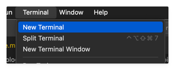
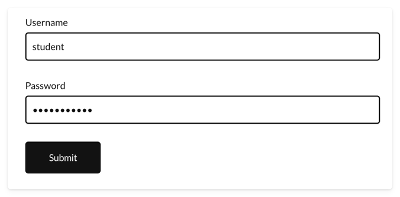

If you're doing synthetic monitoring with Robotmk in the Checkmk environment, sooner or later you'll encounter this one question: *how do I prevent passwords from ever appearing in plain text?*

This article describes how to use the **CryptoLibrary** to protect sensitive data in Robot Framework tests.


<!--more-->

---

## Why You Should Care About Secrets in Robot Framework

When you start with Robot Framework, it can be overwhelming with the multitude of possibilities and libraries.  
Security is often addressed late in the process – or in the worst case, not at all. It's not uncommon to see test suites with variables like this:

``` robotframework
*** Variables ***
${USERNAME}   robotmk
${PASSWORD}   supersecret123  # BAD!!
${API_KEY}    abcdef123456  # BAD!!
${PIN}        1234  # BAD!!
```

😱 You can't possibly check such a Robot into a Git repository, let alone run it in a production environment!

**Plain text passwords are a no-go** - and yet they are still found frequently.  
The problem: Robot Framework does not provide a built-in solution for securely handling secrets.

> Well - that's not entirely true: check out [Secret Variables](), which have been available since Robot Framework 7. However, they only help if the libraries also support them – and unfortunately, not all do. 

---

## CryptoLibrary: Basics

Let's dive deeper: The **CryptoLibrary** is a library specifically developed for Robot Framework that allows you to securely encrypt and decrypt data.  
It is based on the principle of [asymmetric cryptography](https://en.wikipedia.org/wiki/Public-key_cryptography), where a key pair consisting of a public and a private key is used: 

- 🔑 The "**public key**" is used to **encrypt** the data.
- 🔐 The "**private key**" is used to **decrypt** the data; it is protected with a password

---

## Example Repository

In this article, we use the CryptoLibrary in a practical example that you can try yourself: 
[Checkmk/robotmk-examples/cryptolibrary](https://github.com/Checkmk/robotmk-examples/tree/main/examples/cryptolibrary)

```bash
> git clone https://github.com/Checkmk/robotmk-examples/
```


The Robot file **suite.robot** contains two tests: 

- **Login With Clear Text Password** - The login, as you should not do it 😉
- **Login With CryptoLibrary** - The login with the CryptoLibrary, as it should be (which we will build here) ✅


---


### Installation of the CryptoLibrary

The CryptoLibrary is available as a Python package and can be easily installed with **pip**.  
Robotmk internally uses **RCC**/**micromamba** to create the required Python environments.  
Therefore, a simple entry in the `conda.yaml` is sufficient to make the CryptoLibrary available in the Robot tests:

``` yaml
channels:
- conda-forge
dependencies:
- python=3.12
- pip=23.2.1
- nodejs=22.11.0
- pip:
  - robotframework==7.1
  - robotframework-browser==19.12
  - robotframework-crypto==0.3 # <---
```

---

### Creating and Activating the Environment

If you haven't installed RCC yet, you can find a detailed guide in this article: [RCC: Efficient Python Integration](https://www.robotmk.org/en/blog/rcc-efficient-python-integration)

```bash
> cd examples/cryptolibrary
# Create the environment
> rcc task shell
...
# Test: Python is available, we are in the activated environment
> which python3
/Users/simon/.robocorp/holotree/3a200ec_5a1fac3_172e83c1/bin/python3
```

**Bonus Tip:** Start VS Code directly from the activated environment; this way, you don't need to configure anything in VS Code to use the environment's Python interpreter:

```bash
> code . 
```

---

### Generating the Key Pair and Encrypting Secrets

Before we can start using the CryptoLibrary, we need a **key pair**.  
You can generate this using the **CLI tool** of the CryptoLibrary.  
Open a new terminal in VS Code (if one is not already open)...




...and start the wizard with the command: 

```bash
> CryptoLibrary
```

 

For better readability, I list here the steps you go through in the wizard. Each indentation corresponds to a sub-level in the wizard:

- Open Config
  - Configure Key Pair
    - Set Key Path
      - `keys` (any name, as long as the folder is included in the project)
      - Yes (create)
    - Generate Key Pair
      - Yes (regenerate)
      - No (do NOT save the password ⚠️)
      - `rmksecret` (Password for the private key)
      - `rmksecret` (Confirm password)
    - Back
  - Back
- Encrypt
  - `Password123` (the secret you want to encrypt)

Of course, you can encrypt as many other secrets as you want here: API keys, PINs, credentials – anything you don't want to have in plain text in your tests.  
After each input, the encrypted value is output, e.g. for the password `Password123`:

```bash
crypt:s7Jiwve6YIzsyqVlGxndTAjIYQqg84lTT/1it/pqcCsV0w81Kfk0tQc4M1kiDxnqO1i0J9ZtgH0BUSA=
```

Copy the *entire* string (including `crypt:`) and paste it into your Robot variable, e.g. 

```
*** Variables ***
${URL}      https://practicetestautomation.com/practice-test-login/
${USERNAME}  student
${PASSWORD_CLEAR}  Password123  # this is BAD!
${PASSWORD_CRYPT}  crypt:s7Jiwve6YIzsyqVlGxndTAjIYQqg84lTT/1it/pqcCsV0w81Kfk0tQc4M1kiDxnqO1i0J9ZtgH0BUSA=
```

---

### Importing the CryptoLibrary in the Robot

The `CryptoLibrary` is now imported in the Robot file in the `*** Settings ***` section. The three main arguments control the decryption process:

- `key_path`: Relative path to the folder containing the keys (in our case `keys`).
- `password`: The password to unlock the private key - read from the environment variable `RMKCRYPTPW` (see next section).
- `variable_decryption`: Enables automatic decryption of all variables starting with `crypt:`.

``` robotframework
*** Settings ***
Library    Browser
Library    CryptoLibrary    
...    key_path=keys
...    password=%{RMKCRYPTPW}
...    variable_decryption=True    
```


---


### Fill Secret vs. Fill Text

In our example test, we use the well-known [Browser Library](https://marketsquare.github.io/robotframework-browser/Browser.html).  
For entering sensitive data into web forms, you should use the keyword `Fill Secret` ([Link](https://marketsquare.github.io/robotframework-browser/Browser.html#Fill%20Secret)). It behaves similarly to `Fill Text` but prevents the entered value from appearing in the Robot logs:

```
Login With CryptoLibrary
    Fill Text  id=username  ${USERNAME}
    Fill Secret  id=password  $PASSWORD_CRYPT   # <----
    Click  id=submit
    Wait For Condition  Text  body  contains  Logged In Successfull
```

> Note that `Fill Secret` does not accept a regular variable like `${PASSWORD_CRYPT}`, but requires the special syntax `$PASSWORD_CRYPT`.
This prevents Robot Framework from logging the value that has already been decrypted by the CryptoLibrary at this point (like all arguments). However, the Python code in the `Fill Secret` keyword can still access the decrypted variable and enter it correctly into the form.


---

### Storing the key password in the Systemd unit

If you're wondering why we also have the private key in the repo, even though it should actually be secret - here's the answer:  

The private key is only usable with the *password* – and the password does not belong in the code, but as an environment variable in the Systemd unit of the Checkmk agent.  
This is done using a so-called [Systemd Override](https://dev.to/redrum_yot/understanding-drop-in-overrides-in-systemd-when-parameters-accumulate-vs-override-3noi):

```bash
> systemctl edit check-mk-agent-async.service
```

Now add the following lines to the opened file:

```ini
[Service]
Environment="RMKCRYPTPW=rmksecret"
```

Then reload Systemd and restart the agent:

```bash
sudo systemctl daemon-reload
sudo systemctl restart check-mk-agent-async.service
```

> Windows users should set a system environment variable for this. 

Now the environment variable `RMKCRYPTPW` is available in the context of the Checkmk agent or Robotmk scheduler. The CryptoLibrary in the Robot can use it to unlock the private key and decrypt the values in the tests.

---

### Test run (and a little trick)

To test the Robot on your machine locally, you would of course also need the environment variable `RMKCRYPTPW`. You could set it in your bashrc or zshrc, but that would be a bit cumbersome if you just want to quickly test the Robot. 

For this reason, I will share a little trick that relates to one of my favorite topics in Robot Framework: the `robot.toml` file.

`robot.toml` is a configuration file for the VS Code extension [RobotCode](https://robotcode.io) by Daniel Biehl. It is a true "wonder weapon" for local development because it allows, for example, the creation of execution profiles - and also the setting of environment variables that only apply to the Robot test run.

`robot.toml` is usually committed to Git, but for sensitive data (and this now includes the password for the private key!), there is also the file `.robot.toml`. It is intended for local overrides and is not checked into Git (=> `.gitignore`).   

```bash
[env]
RMKCRYPTPW = "rmksecret"
```

Now you can run the Robot directly in VS Code without having to worry about setting the environment variable:

 

And here we go - the login is performed without sensitive data appearing in plain text in the logs! 🎉



---

## Conclusion

The **CryptoLibrary** solves a problem that frequently arises in everyday use with Robotmk: storing credentials securely in Robot code without exposing them in plain text.  

The effort required for setup is manageable – and the results are convincing. 

Are you already using the CryptoLibrary – or do you rely on a different approach? I'm curious about your experiences. Feel free to share them in the comments, I'm happy to help! 👇


