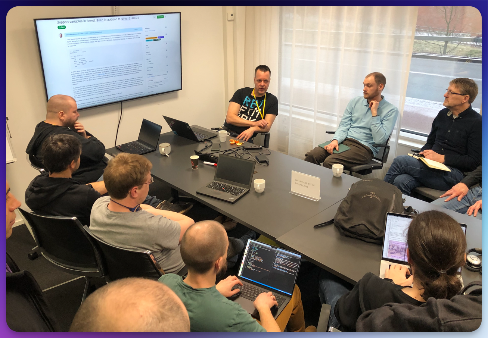
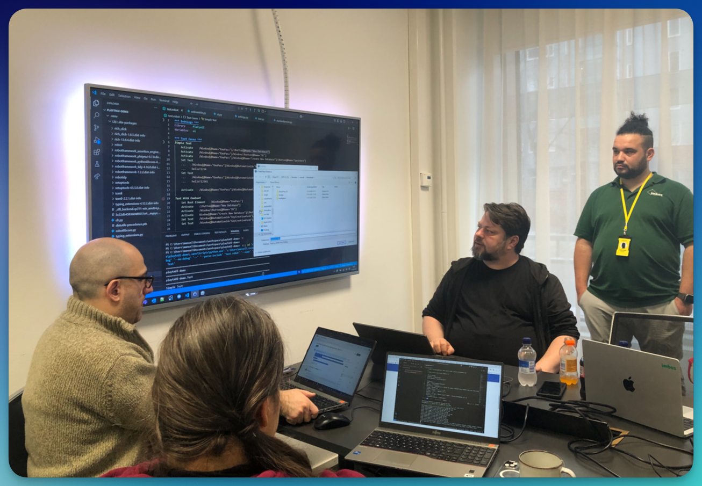
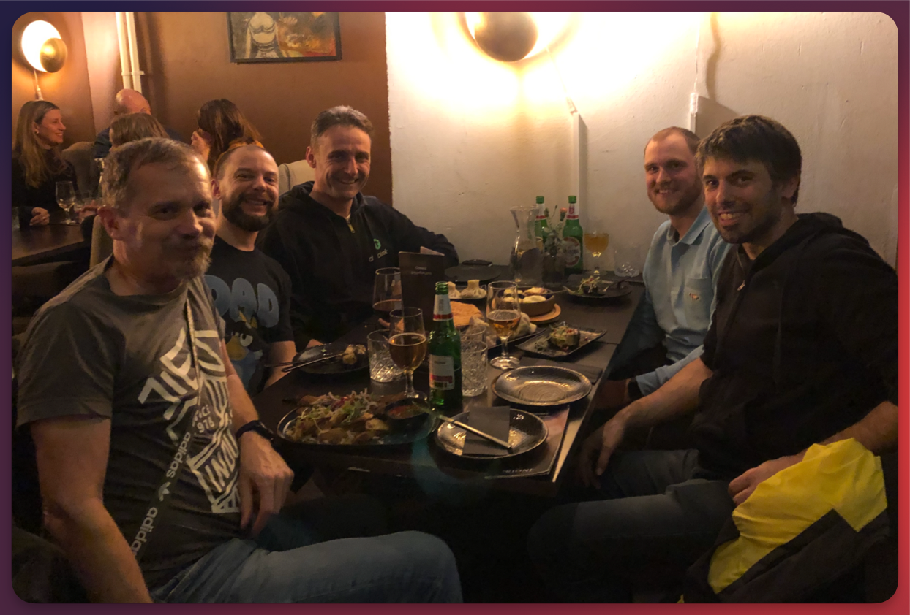

Die RoboCon-Woche startet traditionell mit dem **"Unconference Day"** – einem Tag, an dem sich die Robot Framework-Community frei organisiert und ohne festes Programm über die Themen austauscht, die sie am meisten bewegen.  

**Mein Resumee von diesem Tag...**

<!--more-->

# RoboCon 2025 – Tag 1: Der Unconference Day 🚀

Dank **Eficode**, die ihre Konferenzräume jedes Jahr für den Community-Tag zur Verfügung stellen, entsteht eine lockere, kreative Atmosphäre, in der **alles kann, aber nichts muss**.  

Es gilt das **"Law of Two Feet"**: Wenn Dir eine Session nicht (mehr) passt, ziehst Du einfach weiter zur nächsten.  

Keine Pflicht, keine feste Agenda – dafür jede Menge spannende Diskussionen und brandneue Einblicke was die Zukunft so bringt. 

Und genau das macht diesen Tag so wertvoll!  

---

## Meine Highlights vom Unconference Day

### DataDriver – Dynamische Testdatenverwaltung in Robot Framework

Die erste Session war mit **René Rohner**, dem Autor der [DataDriver Library](https://github.com/Snooz82/robotframework-datadriver).  
Er zeigte, wie man mit nur wenigen Zeilen Python-Code seine eigene DataReader-Klasse schreiben kann.

**Warum mich das so begeistert?**  

👉 Mit **DataDriver** werden Testdaten **komplett von der Testlogik entkoppelt**.  
👉 Statt einer fest verdrahteten Liste kann man **bei jedem Testlauf neue, zufällige Datensätze verwenden**.  

Ein Beispiel.

In einem **Webshop-Test** müssen 5 Artikel in den Warenkorb gelegt werden. Statt diese nun **fest im Code** zu hinterlegen, kann DataDriver per jedes Mal per custom DataReader aus 10.000 Produkten in der Datenbank 5 zufällig auswürfeln.

Das bedeutet **flexiblere, realistischere Tests** – ein echter Gewinn für **skalierbare Testautomatisierung**!  

---

### Robot Framework 7.3 Planning

Interesant war auch die Session mit **Pekka Klärck**, dem Erfinder und Hauptentwickler von **Robot Framework**.  
Es ist immer spannend, direkt von der Quelle zu hören, **wohin sich das Framework entwickeln wird** – und Pekka gab uns Einblicke in die Überlegungen zur kommenden Version **7.3**.  

Vielversprechend klingen die Pläne für eine neue Syntax zur Maskierung von Variablen, die geheime Daten (wie z.b. Passwörter oder API-Keys) vor einer ungewollten Speicherung in Logs schützt.  

Jeder, der schon mal mit Testautomatisierung in sicherheitskritischen Bereichen gearbeitet hat, weiß, wie wichtig dieses Feature sein wird.  

---

### AI & Robot Framework – Intelligente Testautomatisierung

Ein weiteres spannendes Thema war **KI im Automatisierten Testen** mit **Davi Fogl**. 

Ok, es ging eigentlich um alles, was irgendie mit KI zu run hat. Spannend war für mich, wie er GPT Assistants in seiner Arbeit mit Robot Framework Dokumentation (z.b. dem Syllabus für die RFCP-Zertifizierung) verwendet.

Eigentlich nichts Neues – aber genau darum geht es in der Unconference: **Auf die richtigen Ideen gestoßen werden!**  

---

### PlatynUI – Vielversprechender Ansatz im UI-Testing

Ein absolutes Highlight war die Session von **Daniel Biehl** über seine neueste Entwicklung PlatynUI, einer neuen Library für die Automatisierung von Desktop-Applikationen. 

**Was ist daran so besonders?** Seht Euch mal diese Liste an: 

✅ **Cross-Platform**: Läuft auf **Windows, Mac & Linux**.  
✅ **Robot Framework First**: Nutzt unter Windows **nativ das UI Automation API**, ohne Drittanbieter-Abhängigkeiten, komplett auf Robot Framework zugeschnitten. 
✅ **Kein "Zombie-Klicken" mehr**: Bildmusterbasierte Ansätze wie **ImageHorizonLibrary** haben oft das Problem, dass sie inaktive Buttons „sehen“ und fälschlicherweise anklicken, obwohl die Elemente nicht aktiv sind.  
Ich kenne das aus meiner langjährigen Praxis mit der ImageHorizonLibrary nur zu gut.  
✅ **State-aware**: Die Library erkennt, ob sich die UI nach einer Aktion tatsächlich verändert hat - oder ob sie noch einem Ladezustand verharrt und deswegen noch nicht bereit für den nächsten Klick ist. 

(Das erinnert mich stark an den Sprung, den die BrowserLibrary für Web-Testing brachte:  
Wo man in Selenium früher nach jedem Klick **explizite Wartezeiten** und Assertions einbauen musste, synchronisiert die **BrowserLibrary** automatisch mit dem tatsächlichen Browser-Zustand.)

➡️ **PlatynUI** könnte genau das für Desktop-Testing leisten – und das wäre ein echter **Quantensprung**!  

---

## Mein Fazit zum Unconference Day

- Finnische Müsliriegel sind lecker
- Inspirierende Gespräche
- Brandneue Entwicklungen im **Robot Framework-Ökosystem** entdeckt.  
- Und natürlich ein toller Tagesabschluss beim Georgier **"Rioni"**! 😋  

Die RoboCon 2025 hat offiziell begonnen – und dieser erste Tag hat die Messlatte schon jetzt verdammt hoch gelegt. Ich bin gespannt, was die nächsten Tage bringen!

