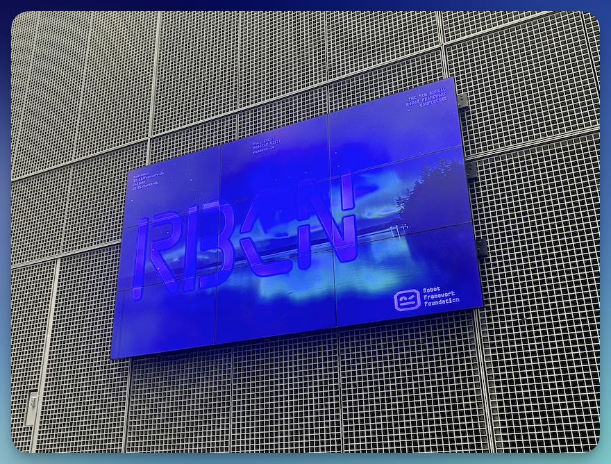
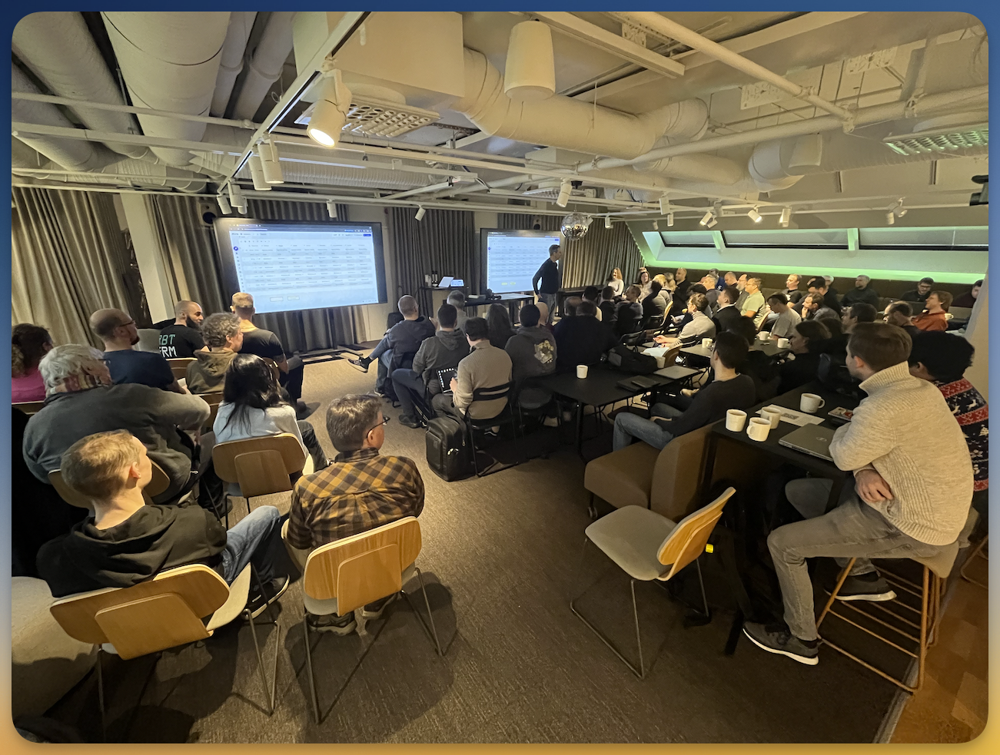
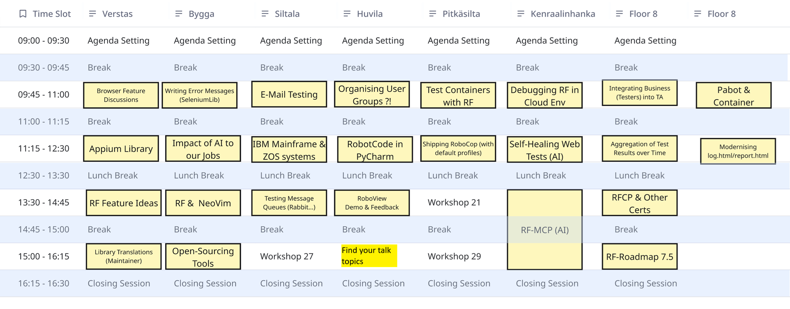

Während ich am Flughafen auf meinen Rückflug wartete, Laptop auf den Knien und noch ganz erfüllt von den Eindrücken der zurück liegenden **RoboCon 2026**, begann ich damit, meine Aufzeichnungen zu sortieren.  
Der erste Entwurf dieses Artikels entstand also quasi zwischen Gate-Ansagen und Boarding-Aufrufen 😉

Hier also ist meine *ganz persönliche* dreiteilige **Rückschau** auf die RoboCon – geprägt von meinen **Eindrücken**, meinen **Schwerpunkten** und den **Themen**, die bei mir besonders nachgewirkt haben.  
Trotzdem hatte ich natürlich den Anspruch, auch den "Daheimgebliebenen" möglichst viel vom "RoboCon-Feeling" mitgeben zu können.  

<!--more-->

---

➛ Weiter zu [Teil 2 (Donnerstag: Konferenz Tag 1)]()  
➛ Weiter zu [Teil 3 (Freitag: Konferenz Tag 2)]()

---

**Vier intensive Tage** in Helsinki liegen hinter mir – voller Gespräche, neuer Impulse, technischer Details und inspirierender Begegnungen.  
Wie jedes Jahr habe ich versucht, so viel wie möglich im Handy mitzuschreiben: Neue Namen, Kerngedanken, prägnante Aussagen, spontane Ideen, offene Fragen.  

Manche Aspekte erschließen sich erst im Nachklang, anderes wirkt im Moment bedeutender, als es später erscheint.

Und doch: Dieses Jahr fühlt sich meine Sammlung noch runder an. Nicht unbedingt lückenlos (leider nicht mit allen Sessions) – aber strukturierter, klarer, näher am Geschehen als noch im vergangenen Jahr.  
Vielleicht, weil ich bewusster zugehört habe. Vielleicht auch, weil ich inzwischen besser weiß, wie ich von der RoboCon am besten profitieren kann.

**Viel Spaß beim Lesen!**

---

## Dienstag: Workshop "PlatynUI Library"

**Lisa Böttinger** + **Fabian Tsirogiannis** (Imbus AG)

Die RoboCon folgt einer bewährten Tradition: Der erste Tag ist einem ganztägigen Workshop vorbehalten. Eine super Gelegenheit, direkt von Profis zu lernen und selbst Hand anzulegen. Für mich persönlich ist das schon immer ein starker Grund, die RoboCon zu besuchen.

Dieses Jahr nutzte die Foundation die Räumlichkeiten der **Haaga-Helia University of Applied Sciences** zur Durchführung der Workshops. 

**Desktop-basierte Testautomation** war für mich schon lange vor Robot Framework ein Thema von Interesse.  
Richtig Fahrt aufgenommen hat es jedoch erst durch die Integration von Robot Framework in Checkmk, die mit meiner Open-Source-Version von [Robotmk](https://robotmk.org) möglich wurde.  
Plötzlich erkannten viele Checkmk-Kunden das Potenzial, nicht nur webbasierte Tests zu automatisieren, sondern auch Desktop- und End-to-End-Tests direkt ins Monitoring zu integrieren.  
Ich wende lange schon die [ImageHorizonLibrary](https://github.com/eficode/robotframework-imagehorizonlibrary) an, um per Bildvergleich grafische Benutzeroberflächen zu testen. Gerade bei älteren UIs, die keine Automation-IDs exportieren, oder auch **Citrix-Verbindungen** ist das immer noch der einzige gangbare Weg.

Aber die neu entwickelte **PlatynUI Library** setzt hier neue Maßstäbe. Entwickelt von **Daniel Biehl** (Imbus AG) – mit bedeutsamen Beiträgen des restlichen Imbus-Teams – adressiert sie ein altes Problem mit einem ganz neuen Ansatz.

Libraries, die über die Windows-API auf UI-Elemente zugreifen, sind an sich nicht neu (um nur ein paar zu nennen: [WhiteLibrary](https://github.com/Omenia/robotframework-whitelibrary), [Zoomba Libary](https://github.com/Accruent/robotframework-zoomba), [FlaUI Library](https://github.com/GDATASoftwareAG/robotframework-flaui), [AutoIT Library](https://pypi.org/project/robotframework-autoitlibrary/)). 

**PlatynUI unterscheidet sich aber in mehreren Punkten grundlegend:**

- Ein konsequent **Robot-Framework-first** Ansatz – ohne Umwege über Third-Party-Tools
- Unterstützung für macOS, Linux und Windows (mit Schwerpunkt Windows aufgrund von Imbus-Kundenanforderungen)
- Ein eigener Spy-Editor zur Inspektion von UI-Elementen
- Eine durchdachte Philosophie zum Klicken auf Elemente

Der letzte Punkt verdient besondere Aufmerksamkeit.  
Wer per Bildvergleich grafische Oberflächen automatisiert, muss sich eines klarmachen: Die Test-Library weiß *überhaupt nicht*, worauf sie tatsächlich klickt.  
Sie handelt auf Basis von Pixelmustern.  
Die [ImageHorizonLibrary](https://github.com/eficode/robotframework-imagehorizonlibrary) beispielsweise funktioniert so: Das Keyword `Click Image  ok_button.png` vergleicht zur Testlaufzeit den aktuellen Bildschirminhalt (in-memory Screenshot) mit einem vorher aufgenommenen Referenzbild.  
Wird es gefunden, klickt die Library auf die Bildschirmmitte genau dieser Treffer-Region.  
Das Prinzip ist mathematisch simpel, aber es hat eine kleine **Schwachstelle**: Der Klick beruht auf der Annahme, dass das Element den Klick auch akzeptiert – in 99% der Fälle ist das auch so, aber eben nicht garantiert.

PlatynUI führt hier ein separates Keyword ein: **Activate**.  
Der Name wirkte auf mich zunächst unintuitiv (man "aktiviert" doch nicht einen Button, man "klickt" ihn...).  
Doch genau das ist die Pointe: Die Library klickt nur auf das, was auch wirklich sicht- und **anklickbar** ist.  
Es ist eine elegante Sicherheitsstufe, die Fehlannahmen früh abfängt.

Lisa Böttinger und Fabian Tsirogiannis führten den Workshop souverän durch – von der `uv`-basierten Umgebungserzeugung bis zur Installation der Abhängigkeiten.  
Ausreichend Zeit für eigene Experimente und praktisches Lernen machte den Tag komplett.

**Kann man PlatynUI jetzt schon produktiv nutzen?**  
Daniel beantwortet sie (nach wie vor) bewusst vorsichtig: *"It's still in a very, very early stage."* (unter Imbus-Leuten inzwischen ein running Gag 😉)  
Während der Weiterentwicklung können sich grundlegende Dinge also vielleicht nochmal ändern.  
Allerdings: Die **Deutsche Flugsicherung** nutzt PlatynUI bereits heute zur Überprüfung von Fluglotsen-Interfaces. Das deutet auf einen hinreichend reifen Stand hin. Probiert die Library einfach mal aus!

Heute erst hatte ich einen Kunden-Call - der Kunde möchte einen Desktop-Test unbedingt mit PlatynUI umgesetzt haben. Ran an den Speck!  

---

## Mittwoch: The "Unconference Day"

Der Unconference Day fand dieses Jahr in den Geschäftsräumen von **GOFORE** in Helsinki statt (GOFORE ist ein internationales Beratungsunternehmen für digitale Transformation).  
Ein großes Dankeschön an GOFORE dafür, dass das Unternehmen einfach so seine Räume zur Verfügung stellt, damit sich Arbeitsgruppen frei organisieren können. Das erfordert großes Vertrauen.

**Ed Manlove** begrüßte alle am Morgen im großen Versammlungsraum im 8. Stock.  
Der Unconference Day verkörpert genau, was sein Name verspricht: nicht die starre, formale Konferenz mit vorgegebenen Slots, sondern eine lebendige, selbstorganisierende Veranstaltung.  
Die Grundidee stammt aus dem Konzept des "[Open Space](https://de.wikipedia.org/wiki/Open_Space)" von Harrison Owen: *"If you are not learning or contributing in a meeting or situation, you have the responsibility to use your own two feet (or wheels) to move to a more productive place."*  
Ein Prinzip, das sich durch die Struktur widerspiegelt: Flexibilität, Eigenverantwortung, Mut zum Wechsel.

Ed brachte das Konzept auf den Punkt mit vier Säulen: **Be supportive. Build connections. Look for opportunities. Use your head and your gut. And use your heart.**

**René Rohner**, Vorsitzender der RF Foundation, moderierte die Brainstorming-Session, in der Themen gesammelt wurden.  
Die **Vielfalt** war beeindruckend: Von hochstrategischen Überlegungen (Open-Sourcing von Tools, KI-Auswirkungen auf Arbeitsplätze, Integration von Business-Perspektiv in Test-Automation) bis hin zu konkreten technischen Herausforderungen (RoboCop-Konfiguration, Email-Testing, Robot Framework mit IBM Mainframe) – das Spektrum zeigte deutlich, wie breit aufgestellt die Robot-Framework-Community heute ist.

Ich bot auf Anregung von **Ivo Brüssow** (der selbst eine [Usergroup im Münsterland](https://www.meetup.com/robot-framework-usergroup-munsterland/) leitet) die Session "*How to organize user group meetings*" an.  
Unsere Münchner Gruppe ([RFUGM](https://rfugm.robotmk.org)) ist noch jung und klein, aber es freute mich riesig, dass so viele teilnahmen.  
Es war wertvoll zu sehen, welche **gemeinsamen Herausforderungen** überall auftauchen: 

- Gewinnung neuer Mitglieder
- Marketing
- Themenfindung
- Zeitmanagement
- usw. 

Ed besuchte uns dazwischen für ein Foto – aber es war perfekt getimed: Er nutzte den Augenblick, um spontan den Slack-Channel **#usergroup-organizers** ([link](https://robotframework.slack.com/archives/C0AE8RR53V1)) zu eröffnen. Ein Ort, an dem wir uns künftig austauschen können.

Dann schaute ich in der **AppiumLibrary**-Session vorbei.  
Mobile Testautomation mit iOS und Android war schon lange auf meiner Liste, doch ich war im letzten Jahr zu sehr mit meinem Robot-Framework-Trainingsmaterial beschäftigt.  
Das Timing ist jetzt perfekt: **Gabriela Simion** und **Christoph Singer** sind inzwischen die neuen Maintainer und haben die Ärmel hochgekrempelt – [Version 3.0](https://github.com/serhatbolsu/robotframework-appiumlibrary) ist gerade released.  
Ich möchte mit meinen eigenen Tests einen Beitrag leisten und ihnen Feedback geben, denn Maintainance von fremdem Code ist nicht trivial, Regressions-Bugs schleichen sich schnell ein.

Vor dem Mittagessen schnappte ich mir die zweite Hälfte des Browser-Library-Anfänger-Workshops. **Igor Czyrski** von NiceProject machte das mit beeindruckender Ruhe und Struktur – inspirierend zu sehen, wie andere das Thema angehen.

Nach dem Mittagessen saß ich in der Session von **Many Kasiriha** – dem Schöpfer von Robot-MCP. Der Raum war so voll, dass wir kurzerhand nochmal umziehen mussten, und zu Recht: Many hat die seltene Gabe, komplexe Dinge so zu erklären, dass man sofort mehr erfahren möchte. Und beim Thema "AI" hat er mit seinem [MCP-Server für Robot Framework](https://github.com/manykarim/rf-mcp) ins Schwarze getroffen.  
Der erste produktive Use-Case für KI-generierte Tests ist wohl noch nicht auf dem Radar, aber das sollte nicht darüber hinwegtäuschen, dass Many hier Pionierarbeit geleistet hat. Dies ist erst der Anfang einer großen Bewegung.

Ein besonderes Highlight war der Austausch mit **Tatu Aalto** über einen Bug in der Assertion Engine der Browser Library: Kaum eine Stunde später – ich war bereits unterwegs zur nächsten Location – schrieb Tatu auf Slack, dass er ein neues Release veröffentlicht hatte.  
Schnell, kooperativ, pragmatisch. Danke Tatu!  🤗

---

➛ Weiter zu [Teil 2 (Donnerstag: Konferenz Tag 1)]()  
➛ Weiter zu [Teil 3 (Freitag: Konferenz Tag 2)]()
