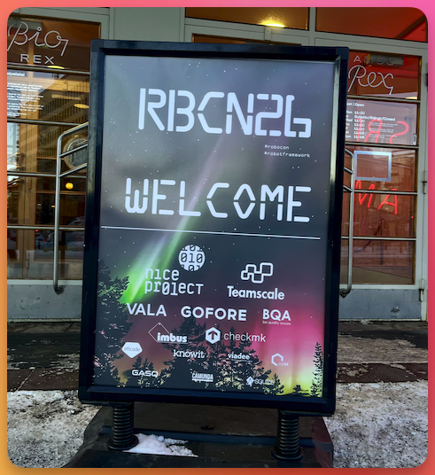
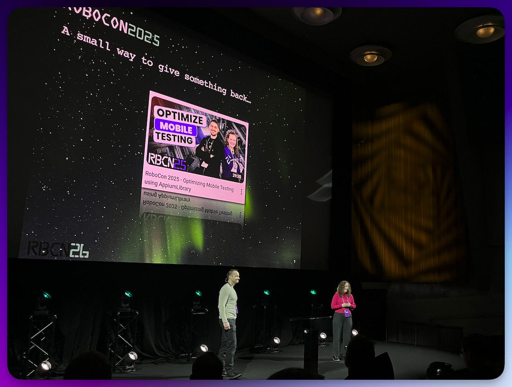
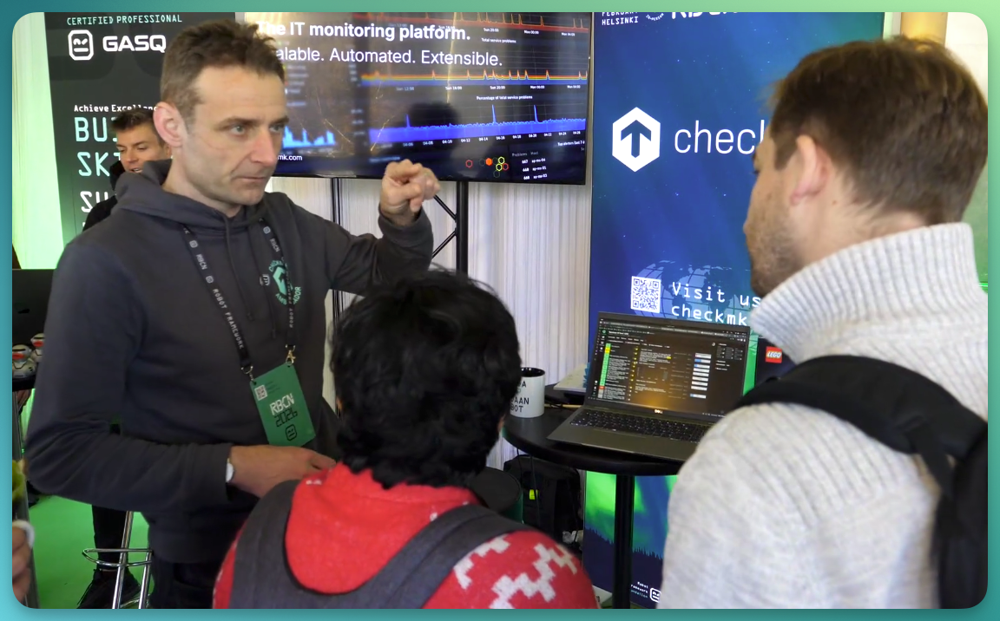
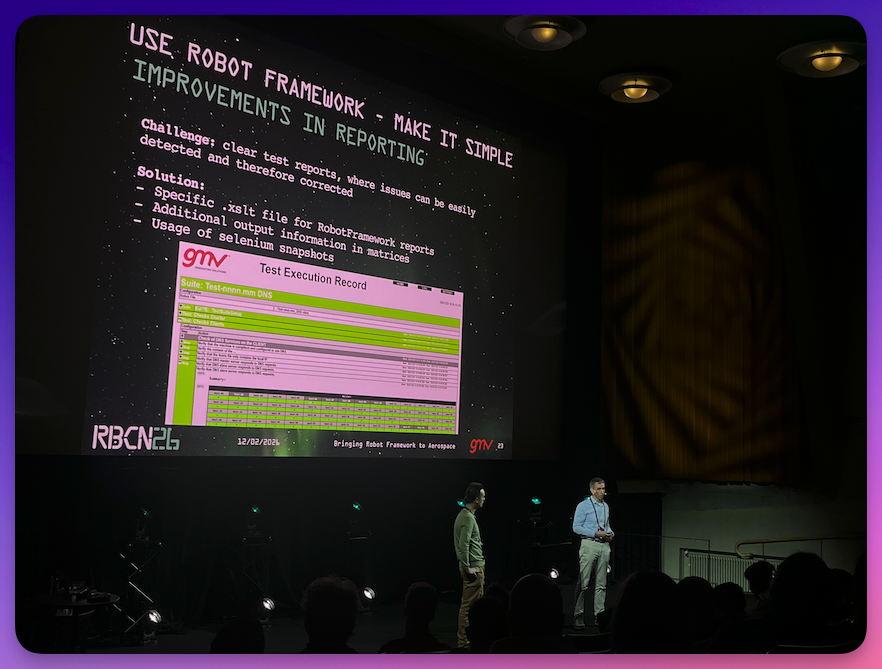
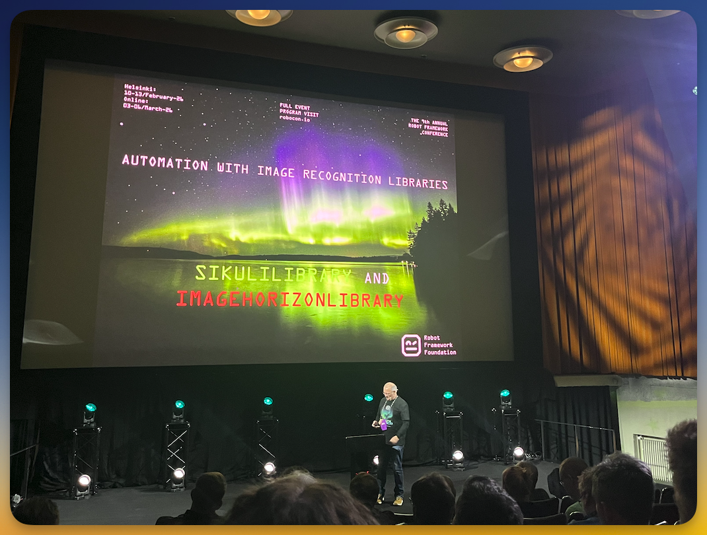
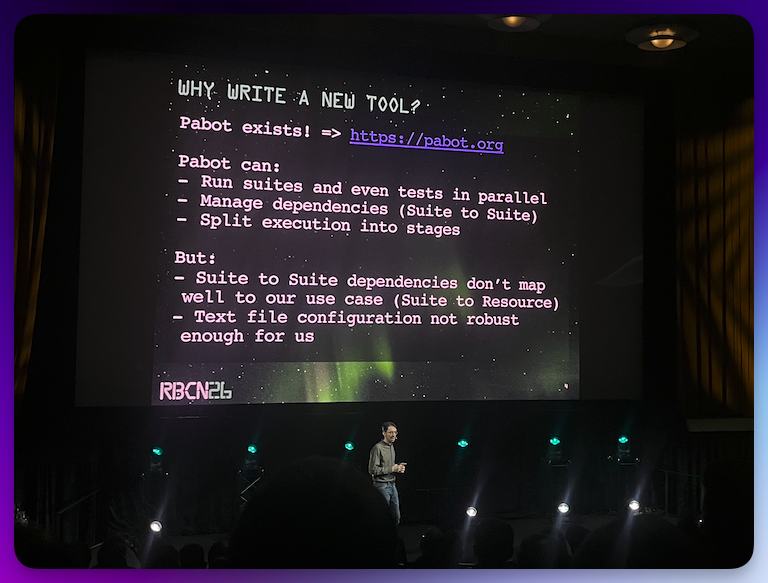
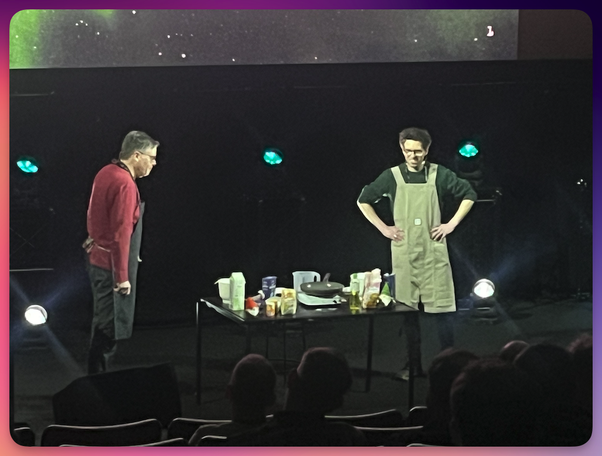

Dies ist **Teil 2** der dreiteiligen Review der RoboCon 2026 in Helsinki.

<!--more-->

---

➛ Zurück zu **[Teil 1 (Dienstag/Mittwoch, Workshop & Community Day)]()**  
➛ Weiter zu **[Teil 3 (Freitag: Konferenz Tag 2)]()**

---

## Donnerstag: Konferenz Tag 1

### Keynote: Community in the age of AI



**Miikka Solmela**, Executive Director der Robot Framework Foundation, eröffnete die Konferenz und seine Keynote mit einer Frage: **Welchen Einfluss hat künstliche Intelligenz auf die Entwicklung der Community?**

Der Graph, den Miikka präsentierte, war bedenklich: Die Zugriffe auf die Robot-Framework-Homepage gehen zurück.  
Konkrete Daten aus Slack liegen zwar nicht vor – doch die Vermutung liegt nahe, dass sich ein ähnlicher Trend dort fortsetzt. 

Der Grund: Bevor es KI gab, suchten wir anders nach Lösungen - heute ist die "Lösung" nur noch einen Prompt entfernt. 
Es besteht die Gefahr, dass sich Menschen nicht mehr über Probleme austauschen, sondern sich direkt an der KI bedienen. 

Doch das Arbeiten an einer Herausforderung gehört zum Lernprozess.  
Der Dialog mit anderen, das gemeinsame Ringen um Lösungen – das formt Verständnis auf eine Weise, die eine unmittelbare KI-Antwort nicht leisten kann.

Miikka machte ausdrücklich klar: Er wolle AI nicht verteufeln.  

Doch er mahnte zur Vorsicht. Wenn wir AI nicht weise einsetzen, riskieren wir, dass die Community, so wie wir sie heute kennen, nicht mehr fortbestehen wird. 
**Die Community ist der größte Schatz** – und sie könnte unter unreflektiertem KI-Einsatz stark leiden.

Seine **Botschaft** war ein Aufruf zum bewussten Umgang: 

- AI als Werkzeug verstehen, nicht als Ersatz für den Austausch.  
- Bequemlichkeit darf nicht dazu führen, dass wir den Kontakt zur Community meiden. 
- Das Miteinander, das gegenseitige Lernen, Herausfordern und Unterstützen ist es, was das Robot-Framework-Ökosystem stark macht.

👉 **Fazit:**  
Eine Eröffnung, die nachdenklich stimmte und den Ton für die Konferenz setzte: Technologie ist mächtig – doch es ist an uns, sie so zu nutzen, dass sie verbindet, statt zu isolieren.

---

### The RoboCon Effect And The Power Of Contributing

**Gabriela Simion** und **Christoph Singer** (beide Imbus AG)





Die Präsentation der beiden erzählte eine Geschichte, die in der Robot-Framework-Community Resonanz gefunden haben dürfte: **zwei Anwender werden zu Maintainern**.

**Gabriela Simion** und **Christoph Singer** beschrieben ihre persönliche Reise, wie der Besuch der RoboCon sie inspirierte, nicht nur Nutzer von Robot Framework zu bleiben, sondern aktive Contributor und schließlich Maintainer der [AppiumLibrary](https://github.com/serhatbolsu/robotframework-appiumlibrary) zu werden (siehe Community Day).  

Im letzten Jahr haben sie das Ruder übernommen und gerade **Version 3.0** der **AppiumLibrary** veröffentlicht.  

Die zentrale Botschaft war nicht neu. Aber sie ist immer noch dringend nötig: Die RoboCon ist mehr als eine Serie von Präsentationen.  
Sie ist ein Raum, in dem Menschen zusammenkommen, Ideen austauschen, neue Perspektiven entdecken, und **einander ermutigen, größer zu denken**.  
Das ist auch meine Erfahrung: Ich sehe die RoboCon als **Katalysator** für persönliche und berufliche Entwicklung, die wiederum auf das Ökosystem von Robot Famework einzahlt.

Ein Kerngedanke der Präsentation war die **Wichtigkeit individueller Beteiligung** – die Idee, dass jeder, unabhängig von Erfahrung oder Hintergrund, etwas Wertvolles zum Ökosystem beitragen kann.  
Das erinnerte mich an Ed Manloves **"Law of 2 Feet"**: Bewege dich einfach zu den Orten, wo du lernen und beitragen kannst.  
Gabriela und Christoph verkörpern dieses Prinzip perfekt.

**Gabriela erzählte**, wie sie zu Beginn einen Library-Entwickler fragte: *"Wie viel Erfahrung als Python-Entwickler braucht es, Maintainer einer Library zu werden?"*  
Seine Antwort war prägnant und ermutigend: *"Just start. Start small and learn by doing it."* 

**Christophs Weg** reichte weiter zurück: 2019 sammelte er am Community Day der Robocon erste Erfahrungen in der Library-Entwicklung an der **WhiteLibrary** . Als er dann später vor der Aufgabe stand, die AppiumLibrary mit den vielen offenen Issues auf Vordermann zu bringen, war er unsicher, ob er geeignet dafür war. 
Doch Ed Manlove sprach ihm gut zu und machte neuen Mut.  
Ein subtiler, aber wichtiger Moment: **Die Community unterstützt sich selbst**.

Durch ihre Geschichte zeigten Gabriela und Christoph die **greifbaren Vorteile von Community-Engagement**: ein erweitertes Netzwerk, Verbesserung des technischen Verständnisses, öffentliche Anerkennung, und nicht zuletzt das tiefe Gefühl, Teil von etwas zu sein, das größer ist als man selbst.

Als sie gefragt wurden, wie es sich anfühlte, das erste Release zu bauen, antworteten sie schlicht: 
> *"Nervös, aber unbeschreiblich... Man ist stolz, dass man hier nun seinen Namen stehen sieht."*   

Diese Antwort traf den Kern dessen, worum es in diesem Vortrag ging: **Beitragen bedeutet Zugehörigkeit.**

👉 **Mein Fazit:** Der Vortrag war ein kraftvoller Reminder: Die echte Stärke des Robot-Framework-Ökosystems liegt nicht am Geldbeutel einzelner Firmen – sie liegt in der **Zusammenarbeit**, dem gegenseitigen **Vertrauen** und der kollektiven Anstrengung der Community-Mitglieder.

---

### Let's play a game! 



Yuris Präsentation stellte die interaktiven Elemente der Konferenz vor, die über die **Gridaly Conference Companion App** organisiert wurden.  
Ziel war es, die Konferenz-Teilnehmer zur aktiven Beteiligung und zum Networking zu motivieren, über ein gamifiziertes System mit Badges, Aufgaben und Robot-Stickern.  
Teilnehmer erledigen verschiedene Tasks (z.b. Besuch der Sponsor-Stände), um Belohnungen zu sammeln. Der Hauptpreis: ein Freiticket für die RoboCon 2027.  

Da ich dieses Jahr **Checkmk** als **Gold-Sponsor** vertreten durfte, kann ich bestätigen: Die Gamification ist wirklich nicht zu unterschätzen.  
Sie bringt die Leute zueinander und lässt sie ins Gespräch kommen. Ich hatte viele sehr gute fachliche Gespräche am Checkmk-Stand.

---

### RF-MCP: Say It, Test It, Ship It



**Many Kasiriha** stellte in seiner Session sein Projekt ([RF-MCP](https://github.com/manykarim/rf-mcp)) vor – eine Lösung für ein fundamentales Problem beim Einsatz von Large Language Models (LLMs) in der Testautomatisierung: deren Neigung zu "halluzinieren", also nicht existierende Keywords/Libraries zu erfinden oder logisch fehlerhafte Testschritte zu generieren.

**RF-MCP** ermöglicht es dem Benutzer, ein Testszenario in Prosa zu schreiben und am Ende Gegenzug ausführbare Robot Framework-Tests zu erhalten.  
Dazwischen passiert etwas magisches: Jeder generierte Testschritt wird vom MCP-Server tatsächlich mit Robot Frameowrk ausgeführt und verifiziert, bevor der finale Code entsteht.  
So wird sichergestellt, dass die KI ausschließlich **validierte Keywords** verwendet, die auch tatsächlich in den verfügbaren Libraries und Resources des Projekts existieren -  und dass am Ende tatsächlich lauffähiger Automatisierungscode entsteht.  

RF-MCP unterstützt inzwischen die Keywords von 

- Browser Library + SeleniumLibrary
- AppiumLibrary
- RequestsLibrary
- DatabaseLibrary
- Django-basierte web frontends

👉 **Fazit:**  
Ich bin zwar bisher niemandem begegnet, der den MCP-Server bereits produktiv zur Testerstellung nutzt.  
Doch das sollte eine Sache nicht verschleiern: **Many hat hier echte Pionierarbeit geleistet**, und dies ist erst der Anfang einer großen Entwicklung, die nicht mehr aufzuhalten ist.   

Wer glaubt, KI werde "niemals" in der Lage sein, Tests so gut zu schreiben wie ein Mensch, wird in einigen Jahren vielleicht schon eines Besseren belehrt.

Natürlich frage auch ich mich, wohin das alles führen wird.  
Doch die besten Antworten auf solche Fragen findet man, indem man sich dem Thema mit offenem Geist nähert.  

Ganz einem Zitat von Wayne Dyer folgend: 

> *"If you change the way you look at things, the things you look at change."*

**Bleibt aufgeschlossen und neugierig!** 😉

---

### Kann KI uns helfen, Bugs in Robot Framework schneller zu finden?



**Fabian Streitel** berät seit über zehn Jahren seine Kunden im Bereich der Testautomatisierung. Er präsentierte einen faszinierenden Ansatz für ein Problem, das viele Teams mit großen Testsuites kennen: Wie kann man **möglichst schnelles Feedback** liefern, wenn die vollständige **Testausführung Stunden oder gar Tage** dauert?

Die Kernidee seiner Präsentation: statt die gesamte Testsuite zu durchlaufen, clustert man Tests und wählt die zur Ausführung aus, die in einem vektorbasierten Raum möglichst weit voneinander entfernt sind - quasi ein "intelligenter Smoke-Test" 😉  

Auf diese Weise wird verhindert, dass die Testroutinen wiederholt redundante Pfade im Code durchlaufen, während andere Bereiche noch ungetestet bleiben.

Fabian zeigte, wie er mittels sogenanntem **Mutation Testing** gezielt hunderte von Bugs in den Robot-Framework-Quellcode (als Testkaninchen) eingebracht hatte – ein kontrollierbares Testszenario, um die Effektivität seines Ansatzes zu beweisen.  

---

### Traceable Automation in Space Projects





Allein der Titel verfing schon bei mir! 🪝 😅  

In einem hochregulierten Umfeld, wo jeder Fehler katastrophale Folgen haben kann, gelten Anforderungen an Testautomatisierung, die weit über typische Web- oder App-Szenarien hinausgehen.

Bruno und José zeigten, wie sie Robot Framework als zentrales Element ihrer Testautomatisierung etabliert haben, eng verzahnt mit Requirements-Management-Tools wie **IBM DOORS**.  

Die Herausforderung bestand darin, eine **bidirektionale Synchronisation** zwischen Anforderungsdefinitionen, Testprozeduren und deren Implementierung zu schaffen. So kann jeder einzelne automatisierte Testfall direkt auf eine spezifische Anforderung zurückverfolgt werden – eine **durchgängige Kette der Nachvollziehbarkeit**, wie sie in derart sicherheitskritischen Systemen wie der Raumfahrt zwingend erforderlich ist.

Die Präsentation beleuchtete dabei nicht nur die technische Integration, sondern auch die organisatorischen Konventionen, die in einem solchen Umfeld natürlich unverzichtbar sind.  
Glücklicherweise erfüllt Robot Framework die regulatorischen Standards und strikten Vorgaben der Luft- und Raumfahrtbranche für Dokumentation, Tagging und Reporting.  

Die Sprecher teilten auch offen ihre **Lessons Learned** – von Fallstricken bis zu konkreten Empfehlungen für andere, die Automatisierung in regulierten oder sicherheitskritischen Industrien einführen möchten. Es war deutlich zu spüren, dass die beiden aus jahrelanger Erfahrung berichteten. 

👉 **Fazit**: Der Vortrag machte klar, dass die Einfachheit und Erweiterbarkeit von Robot Framework keineswegs auf einfache Szenarien beschränkt ist – im Gegenteil.  
Mit der richtigen Disziplin und einem durchdachten Framework lässt sich mit Robot Framework auch in den anspruchsvollsten technischen Umgebungen eine robuste, nachvollziehbare Automatisierung aufbauen. Selten bekommt man Einblick in derart sensible, hochsichere Bereiche. 

---

### Keyword-Driven Performance Testing Without Manual Scripting





Die beiden Sprecher präsentierten eine innovative Architektur, die ein häufig übersehenes Problem adressiert: die Trennung zwischen funktionalen Tests und Performance-Tests. Ihr Ansatz eliminiert diese Lücke, indem er Robot Framework als **"Source of Truth"** für beide Testszenarien etabliert.

Die Kernidee: Funktionale Testszenarien, die bereits in Robot Framework definiert sind, werden automatisch in [Locust](https://locust.io)-Skripte übersetzt – ein leistungsstarkes, Python-basiertes Load-Testing-Tool.  
Was normalerweise manuelles Scripting und spezialisiertes Wissen erfordert, wird hier durch ein keyword-basiertes, intent-getriebenes System ersetzt.

Der Vortrag machte deutlich, dass die Wiederverwendbarkeit von Testdefinitionen ein oft unterschätzter Hebel ist.  
Wenn Teams ihre funktionalen Tests als Grundlage für Performance-Tests nutzen können, entsteht nicht nur Effizienz – es entsteht auch eine engere Verzahnung zwischen Qualitätssicherung und Performance-Engineering - in modernen Entwicklungszyklen unverzichtbar.

---

### Automated Accessibility for "Very Busy" Teams





**Über 90%** (!) der eine Million meistbesuchten Websites weisen **Accessibility-Probleme** auf.  
Das stellt nicht nur ein technisches, sondern auch ein geschäftliches, rechtliches und ethisches Problem dar: Nutzer, die auf assistive Technologien angewiesen sind, stoßen täglich auf Barrieren.   

Das liegt nicht einmal daran, dass Teams das Thema "Accessibility" unbedingt ignorieren wollen. Sondern weil sie schlicht nicht die Kapazität, das Budget oder auch manchmal das spezialisierte Wissen haben, um umfassende manuelle Tests dafür durchzuführen.

Affaf und Lalitkumar zeigten eine **"Shift-Left"-Strategie** auf (wobei "left" = "früher"), die Accessibility-Testing **ganz vorn** im Entwicklungszyklus verankert.  
In ihrem Ansatz gliedert sich das in drei Ebenen:

- Auf **Entwicklungsebene** können Probleme bereits erkannt werden, bevor überhaupt automatisierte Tests geschrieben werden. Verstöße wie etwa fehlende "alt"-Texte oder inkorrekte ARIA-Attribute können die Entwickler direkt beim Coding erkennen und korrigieren. 
- Auf **Testebene** integriert Robot Framework Tools wie [axe-core](https://github.com/dequelabs/axe-core) und  nahtlos in funktionale und Regressionstests. Accessibility-Checks sollen damit Teil des täglichen Testings werden – ohne zusätzlichen manuellen Aufwand.
- Auf **Prozessebene** werden die Tests in CI/CD-Pipelines eingebunden. Erkannte Issues können automatisch getrackt und mit Development-Tasks verknüpft werden, sodass kontinuierliche Validierung stattfindet und Regressionen vor dem Deployment verhindert werden.

Die zentrale Botschaft der Session war klar: Accessibility-Automatisierung ist nicht nur ein Werkzeug zum Aufspüren von Verstößen – sie verdient ein **nachhaltiges System**, in dem Technologie aktiv Diversität und Nutzbarkeit unterstützt.  

Aber auch die Kehrseite beleuchteten die beiden: "*accessibility can backfire*", wenn sie falsch implementiert wird oder wenn automatisierte Checks ein falsches Sicherheitsgefühl vermitteln, ohne die tatsächliche Nutzererfahrung zu berücksichtigen.  
Allzu leichtfertig wird das Thema nämlich einfach nur abgehakt - und Jahre später kann sich kaum einmal mehr jemand an die Rahmenbedingungen erinnern. 

---

### Automation with Image Recognition Libraries



**Hélio Guilherme** ist eine Koryphäe auf dem Gebiet der bildbasierten Testautomation. Seit 2008 schon arbeitet er mit Robot Framework – zunächst bei Nokia Networks in Lissabon – und ist heute Lead Developer und Maintainer der Robot Framework-IDE [RIDE](https://github.com/robotframework/RIDE/) sowie Maintainer der [SikuliLibrary](https://marketsquare.github.io/robotframework-SikuliLibrary/).  
Mit einem Augenzwinkern beschreibt er sich selbst als jemanden, der nicht weiß, ob er "*ein Software Tester ist, der gerne Software Development macht, oder ein Software Developer, der gerne Software Testing macht*". 😉

Seine Session bot eine fundierte **vergleichende Analyse** zweier prominenter Image-Recognition-Libraries für Robot Framework: **SikuliLibrary** und **ImageHorizonLibrary**.  
Diese Libraries sind bei Desktop-Tests unverzichtbar, wenn API-basierte Technologien nicht verfügbar sind – etwa bei Legacy-UIs oder RDP/Citrix-Verbindungen.

#### Sikuli

[SikuliLibrary](https://github.com/MarketSquare/robotframework-SikuliLibrary) basiert auf dem Java-Framework SikuliX und nutzt [Robot Framework Remote](https://github.com/robotframework/RemoteInterface), um Python-Funktionen mit den Java-Libraries zu verbinden.  
Ein wesentlicher Vorteil: Sie bietet **Optical Character Recognition (OCR)** – Texterkennung direkt aus Bildern.  

Der Workflow: Library importieren, *Server starten*, Pfad zu Referenzbildern definieren, Application Under Test (AUT) starten, Interaktionen durchführen (Maus, Tastatur, Bildabgleich, OCR), *Server stoppen*.  
Mit **78 Keywords** ist sie üppig ausgestattet. Der Haken: Man benötigt eine Java Runtime Environment im System. 

#### ImageHorizonLibrary

Die [ImageHorizonLibrary](https://github.com/eficode/robotframework-imagehorizonlibrary) hingegen setzt auf native Python-Module wie `pyautogui` und optional `opencv-python` für präzisere Bilderkennung (erlaubt dann auch einen prozentualen "Similarity"-Wert).  
Sie ist schlanker – **34 Keywords** – und verzichtet auf OCR-Funktionalität.  
Der große Vorteil: Kein Java-Overhead, direkter Einsatz möglich. Der Workflow ähnelt dem der SikuliLibrary, nur ohne Server-Komponente.

#### Vergleich 

Beide Libraries sind **betriebssystemunabhängig**, erfordern aber konsistente Bildschirmauflösungen für reproduzierbare Tests.  

> *Anmerkung aus meiner Erfahrung: das primäre Problem bei der Bilderkennung ist nicht die **Auflösung**. Ein 80x30 Pixel großer Button hat diese Abmessungen auf einem 800x600px Display wie auf einem 4K-Display - es bleiben 80x30 Pixel.  
Viel mehr Einfluss auf die Teststabilität hat, wie die Anwendung ihr **Layout unter verschiedenen Auflösungen**, oder sagen wir besser, Platzbedingungen, ändert.  
Denn dann kann es sein, dass z.b. bestimmte Navigationselemente aus Platzgründen verborgen werden.*

Hélio betonte, dass die Wahl der Library vom konkreten Use Case abhängt: Braucht man Texterkennung aus Screenshots? Dann SikuliLibrary. Geht es um schlanke, rein Python-basierte Bildvergleiche? Dann ImageHorizonLibrary.

Ein kritischer Punkt, den Hélio ansprach: Die **Zukunft der SikuliLibrary** hängt vom zugrunde liegenden SikuliX-Projekt ab, dessen Maintainer die Entwicklung pausiert hat.  
Auch die vollständig in Python integrierte Version **sikulix4python**, die Autor Raimund Hocke entwickeln wollte, ist leider versandet. 

👉 **Fazit**  
Was mich besonders freute: Am Dienstag durfte ich **Jhoiss Baloi** kennenlernen, der die nicht mehr gewartete ImageHorizonLibrary **geforkt** und inzwischen auch **weiterentwickelt** hat.  
Er hat sogar meinen [Pull Request für Edge Detection](https://www.robotmk.org/en/blog/imagehorizon-edgedetection/) integriert und angekündigt, die Library unter neuem Namen zu veröffentlichen.  
Das ist eine großartige Nachricht für alle, die auf diese schlanke, Python-basierte Lösung setzen!  
Mir persönlich ist der Java-Unterbau der SikuliLibrary zu umfangreich, daher bin ich sehr froh über diese Entwicklung.

---

### Integrating Robot Framework in your business strategy



Markus Stahls Vortrag adressierte Herausforderungen, die viele Unternehmen kennen: 

- Wie lässt sich ein Open-Source-Tool wie Robot Framework in klassische Evaluierungsprozesse in Firmen integrieren?
- Vor allem, wenn es keine Firma dahinter gibt, die Enterprise-Support anbietet? 
- Wie mitigiert man die Risiken der Adoption eines freien Tools, dessen Ökosystem auf einer Vielzahl ebenfalls freier Projekte basiert?

Markus zeigte einen **fünfstufigen Plan**, der Unternehmen zeigt, wie sie Robot Framework nicht nur nutzen, sondern strategisch in ihr Geschäftsmodell integrieren können – und dabei gleichzeitig zum eigenen direkten Vorteil zum Ökosystem beitragen.

**Schritt 1: Das Projekt finanzieren (Fund it)**  

Oft schon sehr früh stellt sich die Frage: *Wer bezahlt eigentlich für die Wartung und Weiterentwicklung von Robot Framework?*  
Markus erklärte, wie die [Robot Framework Foundation](https://robotframework.org/foundation/) arbeitet und wohin das Geld investiert wird – etwa zwei Drittel der Kosten für die Konferenz werden durch die Foundation getragen, der Rest durch die Tickets.  
Die Herausforderung: Unternehmen von einer Mitgliedschaft zu überzeugen ist nicht trivial. Traditionelle Mehrwerte wie SLAs oder Premium-Support fehlen. Zudem wird die Roadmap von der Community und dem Projektzweck definiert, nicht von zahlenden Mitgliedern. Das verstehen nicht alle "Entscheider".

**Schritt 2: Ein Tool/eine Erweiterung beisteuern (Contribute a Tool/Extension)**  

Irgendwann kommt der Punkt, an dem man selbst eine Erweiterung programmiert.  
Unternehmen können nützliche Tools, die sie für sich entwickelt haben, als Open Source veröffentlichen – prominente Beispiele sind [PlatynUI](https://github.com/imbus/platynui-sut), [RoboSAPiens](https://github.com/imbus/robotframework-robosapiens) oder [KeyTA](https://pypi.org/project/robotframework-keyta/1.0.10/).  
Das Risiko: Wenn mittel- und langfristig keine externen Contributors gefunden werden, muss das Unternehmen dauerhaft Ressourcen für ein Nicht-Kerngeschäft-Projekt binden. Beratungsunternehmen haben hier tendenziell einen größeren Anreiz.

**Schritt 3: Ein Feature beisteuern (Contribute a Feature)**  

Statt ein ganzes Tool zu entwickeln, kann man auch gezielt fehlende Funktionen in den RF-Core implementieren und als Pull Request einreichen.  
Ein Beispiel: Die **Deutsche Flugsicherung** hat das RobotFramework-Feature [custom test metadata](https://github.com/robotframework/robotframework/issues/4409) bezahlt und implementieren lassen.  
Solche Projekte eignen sich auch hervorragend zur Nachwuchsförderung – Junior-Entwickler sammeln wertvolle Erfahrungen mit Open Source.

**Schritt 4: Support anbieten (Offer Support)**  

Unternehmen können professionellen Support für Open-Source-Tools anbieten, von denen sie oder ihre Kunden abhängig sind.  
Die Leistungen können Tool-Mirroring und die Bereitstellung von Notfall-Fixes im Rahmen von SLAs umfassen.  
Diese Fixes sollten anschließend als Beitrag in das ursprüngliche Projekt zurückfließen.  
Markus betonte, dass hier die neuen Verordnungen wie **DORA** und **CRA** berücksichtigt werden sollten.

**Schritt 5: Offen darüber sein (Be open about it)**  

Der letzte, oft unterschätzte Schritt: **Offen kommunizieren**, dass man Open Source nutzt und unterstützt.  
Stolz auf die eigene Beteiligung zu sein, inspiriert andere und stärkt das Ökosystem.

Markus nutzte die Aufmerksamkeit am Ende seines Vortrags, um eine **neue Open-Source-Governance-Arbeitsgruppe** zu promoten, die die Expertise der Community sammeln und Empfehlungen für Robot Framework und Ökosystem-Projekte etablieren soll.

👉 **Fazit**  
Der Vortrag war eine **inspirierende Ermutigung** für alle, die ihren Arbeitgeber überzeugen möchten, mehr in Open Source zu investieren. Mit konkreten, praktikablen Wegen, wie das geschehen kann.  
Die Botschaft war klar: Es gibt mehr Möglichkeiten als nur "Sponsorship" oder "Freizeit opfern".

---

### Medusa: Resource-aware parallel suite execution made easy

**Edin Tarić**

Edins Session adressierte ein Problem, das viele Teams mit umfangreichen Testsuites kennen: **Wie parallelisiert man Tests effektiv, wenn Ressourcen-Konflikte drohen?**

**INSYS** ist Hersteller industrielle Router, deren Software tagtäglich auf den Devices getestet wird – **1500 Tests**, die sequenziell ausgeführt **bis zu 60 Stunden** dauern würden!  
Ein unhaltbarer Zustand bei täglichen Build-Inkrementen.  
Hier denkt man natürlich gleich an Parallelisierung mit [pabot](https://pabot.org/). Doch hier stieß das Team schnell an Grenzen.

Das **Problem**: Viele der Testsuites benötigen nämlich exklusiven Zugriff auf spezifische Ressourcen – etwa ein bestimmtes Gerät im Netzwerk, einen bestimmten Port oder physische Ressourcen wie DSL-Verbindungen, die nicht mehrfach parallel genutzt werden können.  
Pabot mit manuell geschriebenen Ordering-Files wurde bei über 1000 Tests schnell unübersichtlich und ineffizient.  
Versuche, die Ordering-Datei zu automatisieren, scheiterten: Dynamisches Vermeiden von Ressourcen-Konflikten ist schlicht nicht das, wofür pabot designed wurde.

**Medusa** wurde explizit um die Idee von **Ressourcen-Abhängigkeiten** herum entwickelt.  

Jede Suite deklariert ihre Ressourcen-Abhängigkeiten als **Metadaten**, und Medusa bestimmt zur Laufzeit automatisch, welche Suites parallel starten können – das maximiert die Zeiteffizienz und vermeidet Konflikte.

Zusätzlich zu den Dependencies wird jede Suite einer **Stage** zugewiesen: Stages sind **sequenziell ausgeführte Gruppen**, innerhalb derer die Suites wie beschrieben parallel laufen.  
So behält man die nötige Kontrolle über die Reihenfolge, wo es darauf ankommt.

Suites können mehrfach auch mit **unterschiedlichen Variablen** ausgeführt werden – sogar mit unterschiedlichen Dependencies oder Stages.  
Das reduziert Code-Duplikation erheblich, wenn man eine Suite für mehrere Targets oder Varianten nutzen möchte.

Technisch funktioniert Medusa also als **Wrapper** um Robot Framework: Nahezu alle Robot-Optionen werden akzeptiert und an die Prozesse weitergereicht, die die einzelnen Suites ausführen.  
Das bedeutet: **Listener, Pre-Run-Modifiers** und andere Erweiterungen allesamt bleiben nutzbar.  
Am Ende nutzt Medusa `rebot`, um die Ergebnisse aller Suites nahtlos zusammenzuführen – selbst bei massiver Parallelisierung.

👉 **Fazit**:  

Perfect Timing, Medusa wurde rechtzeitig vor der RoboCon 2026 als Open Source veröffentlicht.  
Für alle, die mit großen Testsuites und Ressourcen-Konflikten kämpfen, könnte Medusa genau die Lösung sein, auf die sie gewartet haben.  
Ein pragmatischer Ansatz, der ein echtes Problem mit einer durchdachten Lösung gut adressiert. Ich fand das System sofort eingängig. 

---

### From Batter to Better: Pancakes as Testing





**Kelby Stine** und **Elout van Leeuwen** präsentierten eine der unterhaltsamsten Sessions der RoboCon 2026.  **Pfannkuchenbacken als Metapher für Testautomatisierung** – und machten damit abstrakte Konzepte auf erfrischende Weise greifbar.

Die Bühne war entsprechend vorbereitet: Ein Tisch mit Herdplatte, Pfanne, Zutaten – und beide Sprecher in Kochschürzen.  

Raunen im Publikum. 

*Was wird hier gleich passieren?*

Die Präsentation begann mit einem simplen Bekenntnis: 

Beide lieben **Pfannkuchen**.  

Und dann machten sie sich daran, die Teige dafür mit **zwei verschiedenen Rezepturen** zuzubereiten – jeder auf seine eigene Art.  
Die unterschiedlichen Zubereitungsweisen wurden parallel als **Robot-Framework-Pseudocode** auf der Leinwand dargestellt.  
Ein brillanter visueller Einfall, der die Parallelen deutlich machte.

> *Netherlands 🇳🇱 meets the US 🇺🇸 ... Ich persönlich war ja  mehr Fan von Elouts schlichtem Rezept – bis auf die ganze Hand voller Salz, die er theatralisch im Scheinwerferlicht staubend in den Teig schmiss 😅.  
Aber das war natürlich Teil der Show, denn auf der Bühne durfte aus Sicherheitsgründen ohnehin nicht tatsächlich gekocht werden, der Teig diente rein der Demonstration.*

Die **Kernidee** der Session: Es gibt strukturelle **Analogien** zwischen Kochrezepten und dem Keyword-Driven Ansatz von Robot Framework. Die Keywords beschrieben abstrakt, was zu tun ist, und kapseln die ganzen Details, um die man sich als Tester/Pfannkuchenkoch nicht explizit kümmert.  

Sowohl beim Kochen als auch beim Testen sind **Zutaten** (Ingredients), **Umgebung** (Environment), **Setup** und **Arbeitsschritte** (cooking steps) zentral.  

Beide betonten: *"Make sure variables are OK. Otherwise it will break."* – eine Aussage, die natürlich für Teig wie für Code gleichermaßen gilt.  
(Gerade erst heute habe ich wieder selbst Brot gebacken und musste beim Teig kneten daran denken 😉)

Ein weiteres schönes Detail: **Pfannkuchen gibt es überall auf der Welt** – das repräsentiert die internationale Community.  
Es gibt kein Pfannkuchen-Rezept, das besser ist als ein anderes – genau wie es in der Automatisierung keine Lösung gibt, die für alle Szenarien die beste ist.  

Auch das **Toolset** variiert: Manche setzen auf Parallelisierung – visualisiert durch eine große Kochplatte mit vielen Pfannen.  
Andere bevorzugen sequenzielle Abläufe.  
Beides ist legitim, beides hat seinen Platz.

Dann zuletzt die Behandlung des Themas **Reporting**:  
*"HOW WOULD YOU LIKE YOUR TEST RESULTS SERVED?"*  
Auf der Leinwand erschienen verschiedene Anrichtvarianten von Pfannkuchen: mit Puderzucker, mit Sirup, mit Früchten, gestapelt oder einzeln.  
Die Botschaft war klar: Testergebnisse können auf viele verschiedene Arten aufbereitet und präsentiert werden – je nach Zielgruppe und Zweck.

Besonders witzig wurde es am Ende, als Fragen aus dem Publikum kamen - man merkte, wie sich die Fragen gegenseitig überboten:  

*"...When are you taking it to production?"*  
*"...Do you need acceptance testers?"*  

Und dann setzte **René Rohner** noch einen drauf: Er untersuchte kritisch den Tisch und meinte dann trocken:  

*"But it does not seem to be open source – there is no **fork**."*  😅

**Fazit:**  
Das Ganze war kurzweilig, unterhaltsam und gleichzeitig lehrreich.  
Die Session stellte heraus, was der **Mehrwert von Robot Framework ist**: Nämlich, dass es die Komplexität von Python abstrahiert und in eine **menschenlesbare Sprache** übersetzt.  

Eine wunderbare Art, ernste Konzepte mit Leichtigkeit zu vermitteln.

---

➛ Zurück zu [Teil 1 (Dienstag/Mittwoch, Workshop & Community Day)]()  
➛ Weiter zu [Teil 3 (Freitag: Konferenz Tag 2)]()
