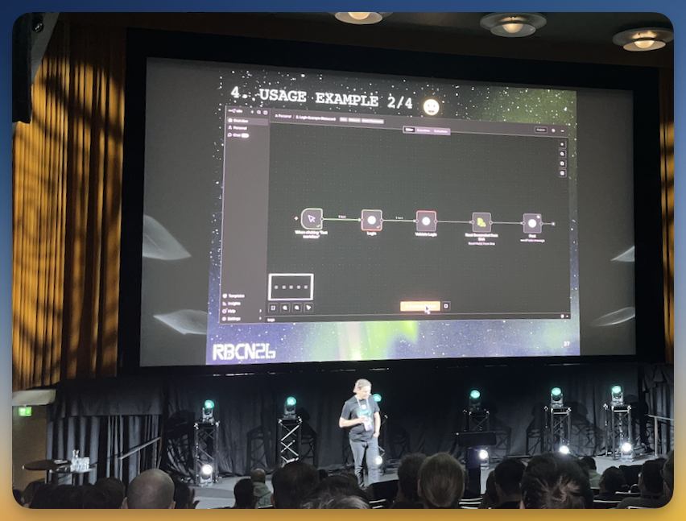

Dies ist **Teil 3** der dreiteiligen Review der Robocon 2026 in Helsinki.

<!--more-->

---
➛ Zurück zu [Teil 1 (Dienstag/Mittwoch, Workshop & Community Day)]()  
➛ Zurück zu [Teil 2 (Donnerstag, Konferenztag 1)]()  
---

## Freitag: Konferenz Tag 2

### Robot Framework Core Updates



**Pekka Klärck** ist bekanntermaßen der **Erfinder** und Lead Developer von Robot Framework.  
Er startete das Projekt 2005 als Teil seiner Masterarbeit an der Helsinki University of Technology (heute Aalto University) und steuert seitdem die Entwicklung.  
Pekka bietet traditoinell am zweiten Konferenztag einen **Überblick** über alle Entwicklungen und Aktivitäten rund um Robot Framework: welche neuen Libraries entstanden sind, welche großen Updates es gab, wer sich besonders hervorgetan hat – all das findet hier seinen Platz.

Zwei Features im Core der Versionem **7.3** und **7.4** stechen besonders hervor:  

- **Variable Types**: Die Möglichkeit, Variablen-Typen explizit zu deklarieren, verbessert die Code-Qualität und reduziert potenzielle Fehlerquellen. Gerade in größeren Projekten ist das ein echter Gewinn an Klarheit.
- **Secret Variables**: Ein längst überfälliges Feature, das die Handhabung sensibler Daten wie Passwörter oder API-Keys erheblich sicherer macht. Keine Klartext-Credentials mehr in Logs – ein wichtiger Schritt in Richtung Production-Ready-Automation. (Siehe auch mein [Artikel](secretvars/) dazu)

Ein weiteres Thema: Ein neues **Manual** ist in Arbeit, wird aber noch etwas dauern. Pekka rief die Community zur Mitarbeit auf.  
Wer sich beteiligen möchte, kann sich im Slack-Channel [#manual-editing](https://robotframework.slack.com/archives/C063Y9GEMUP) melden.  

Dann kam ein Thema, das sicher vielen aus der Seele sprach: **Namespace-Handling**. Aktuell existiert bei Library- und Resource-Imports nur der **Suite-Scope** – und das ist, ehrlich gesagt, problematisch.

Wenn beispielsweise ein Keyword in einem Resource-File definiert wird und dort auch nur genutzt werden soll, ist es dennoch von überall aus zugreifbar.  
Es fehlt in Robot Framework schlicht die Möglichkeit, Keywords als **privat** zu markieren.  
Das führt zu unübersichtlichem Code und ungewollten Abhängigkeiten – gerade in großen Projekten ein echtes Ärgernis.

In **Version 8** will Pekka dieses Problem angehen. Die geplanten Änderungen werden mehr Kontrolle über die Sichtbarkeit von Keywords und Variablen ermöglichen – ein lange erwarteter Schritt hin zu saubererem, modulareren Code.

Wie jedes Jahr bot Pekka auch einen Überblick über die **aktuellen Beiträge aus der Community**. 

Bei der Gelegenheit ein Tipp meinerseits: Die Seite [awesome-robotframework](https://github.com/MarketSquare/awesome-robotframework) bietet einen großartigen Überblick über **alle Robot-Framework-Projekte** – sei es Libraries, Listener oder Third-Party-Projekte.  

Wer etwas Bestimmtes sucht oder einfach nur stöbern möchte, sollte dort unbedingt vorbeischauen.

---

### Bringing Robot Framework into n8n Visual Workflows



Automatisierungen entfalten ihren größten Wert, wenn sie mit anderen Tools und Services interagieren.  
Genau hier setzt Namiks Projekt an: **n8n-nodes-robotframework** ermöglicht es, Robot-Framework-Tasks direkt in n8n's visuelle Workflows zu integrieren – und damit Zugriff auf das ganze Ökosystem der Integraitonen zu erhalten. 

Das bedeutet: Robot Framework Tests lassen sich nahtlos mit den Nodes für APIs, Datenbanken, Messaging-Systemen und KI-Services verbinden – alles visuell konfiguriert, ohne zusätzlichen Code schreiben zu müssen.

Natürlich könnte man einwenden: *"Das lässt sich doch alles auch mit Robot Framework direkt lösen."*  
Klar – aber die Nodes in n8n kapseln die Funktionalität von APIs bereits auf einem **höheren Abstraktionslevel**.  
Das spart Zeit und reduziert Komplexität erheblich.

Namik zeigte in seinem Vortrag einige anschauliche Beispiele.  
Zwar nicht beruflicher Natur, sondern rein privat – bisher ist das ein **reines Privatprojekt** (doppelter Respekt dafür! 👏)  – aber die Use Cases waren trotzdem hochspannend:

Namik automatisierte das **Aufladen seiner Handy-Prepaid-Karte** 📱 mit 8n.  
**Problem**: der Provider stellt hierfür keine API bereit.  
**Lösung**: Per n8n-cron startet er ein Robot-Framework-Script, das sich headless mit Playwright ([BrowserLibrary](https://marketsquare.github.io/robotframework-browser/Browser.html)) beim Provider einloggt und das Guthaben auflädt.

Im zweiten Beispiel wollte Namik wissen, ob bei **Autoscout interessante Autos zum Verkauf** 🚘 stehen, die er vielleicht mit Gewinn weiterverkaufen könnte.  
Das **Problem**: Die Benachrichtigungen von Autoscout kommen oft viel zu spät (manchmal erst einen Tag später) – dann ist das Auto längst weg.  
**Lösung**: Per n8n hat er das automatisiert. Das System prüft regelmäßig (natürlich mit einem **randomisierten Intervall** wegen der Bot-Erkennung) auf neue Autos.  
Falls ein interessantes Angebot erscheint, bekommt er eine Mail mit Screenshot.  
Dank n8n kann er auch gleich eine **KI-Bewertung** durch OpenAI reinhängen, die ihre Einschätzung zum Wiederverkaufswert gibt.

> *Nebenbei, ein toller Tipp von ihm für alle, die damit kämpfen, von der Gegenstelle als Bot erkannt zu werden: es ist einen Versuch wert, die Permission **"geolocation"** im [New Context](https://marketsquare.github.io/robotframework-browser/Browser.html#New%20Context)-Keyword auf `true` zu setzen.  
Bots haben die Geolocation gewöhnlich nicht aktiviert.  
Auch das manuelle Setzen des **User-Agents** ist eine wirkungsvolle Strategie, um an Bot-Sperren vorbeizukommen.  
(Naütrlich gleich alles in mein [Trainingsmaterial](https://lp.robotmk.org/robotmk-masterclass-4d-de) aufgenommen ☺️)*

Besonders clever: Mit dem Keyword [Save Storage State](https://marketsquare.github.io/robotframework-browser/Browser.html#Save%20Storage%20State) speicherte Namik die aktuelle Browser-Session (z.B. alle gesetzten Cookies), und übergab sie an den nächsten Node.  
Damit kann der folgende Node direkt im **eingeloggten Zustand** weitermachen – ein eleganter Weg, der Teilschritte an separate Nodes delegiert.

👉 **Fazit**  
Namiks Vortrag war für mich persönlich ein Highlight. Ich nutze [n8n](https://n8n.io) schon seit Langem und kenne mich entsprechend gut damit aus – es ist ein fantastisches Tool für Workflow-Automatisierung.  
Der Vortrag war inspirierend, technisch fundiert und zeigte eindrucksvoll, wie **visuelle Workflow-Automatisierung** und **Robot Framework** sich gegenseitig ergänzen können.  
Ich habe im Flieger heimwärts über die Zukunft von RPA nachgedacht und muss sagen: wer Businessprozesse automatisieren will, sollte sich insgesamt statt Robot Framework n8n ansehen. 

---

### Climbing the Mountain: Our Journey We Couldn't Make Alone





Die Session von Igor Czyrski und Jerzy Głowacki vom NiceProject QA-Team erzählte eine Geschichte, die manche in der Robot-Framework-Community nachvollziehen können:  
den Weg von der **initialen Tool-Adoption** bis hin zum **aktiven Community-Building**.  

Die beiden nutzten die Metapher einer **Bergbesteigung**, um ihre vierjährige Reise zu illustrieren – eine Analogie, die sich durch die gesamte Präsentation zog.

2020 startete NiceProject mit Robot Framework. Die Entscheidung fiel aufgrund der Vielseitigkeit, doch die zunehmende Projektkomplexität – insbesondere bei der Desktop-Automation – offenbarte schnell die **Grenzen isolierten Arbeitens**.  

Eigene Custom Libraries stießen an ihre Kapazitätsgrenzen.  
Die "steilen Hänge" technischer Roadblocks erforderten letztlich die Suche nach breiterer Expertise.

Igor und Jerzy beschrieben dann die Phase der **kritischen Transition**: von lokalen Anwendern zu aktiven Teilnehmern im globalen Ökosystem.  

Ihre Reise führte über mehrere Schlüsselphasen = "Camps": Die **Discovery Phase**, in der das Team erkannte, dass die bisherigen Methoden nicht mehr ausreichten.  

Dann die **Community Integration** – internationale Treffen wie die RoboCon wurden zur "Berghütte" für das Team. Ein Ort der Sicherheit, des Wissensaustauschs und der Regeneration.

Der entscheidende Wendepunkt für sie war dann der **Shift von Climbers zu Guides**: NiceProject trat der Robot Framework Foundation bei und etablierte die [WRobocon](https://wrobocon.eu) – eine zweite große Robot-Framework-Konferenz.  

Inzwischen zieht diese "*kleine Schwester der Robocon*" ebenso Speaker aus der ganzen Welt an und erfreut sich großer Beliebtheit.  
Dieser strategische Schritt hin zur aktiven Contribution zeigt exemplarisch, wie aus Konsumenten von Open Source echte **Enabler** und Multiplikatoren werden können.

Natürlich ist nicht gleich jeder der geborene Community-Gründer und wir brauchen auch keine 100 Robocons auf dieser Welt. 😉  
Die zentrale Botschaft der Session war eine andere: **Technisches Wachstum ist selten ein Solo-Projekt**.  
Die beiden betonten, wie kollaborative Umgebungen die Resilienz ganzer Teams stärken.  
Ihr Weg – dokumentiert über die verschiedenen "Höhenstufen" der Bergbesteigung 🏔️ – machte deutlich, dass echter Fortschritt dann entsteht, wenn Organisationen ihre isolierte Implementierung hinter sich lassen und zum aktiven Teil der Community werden.

👉 **Fazit**: Ein wirklich inspirierender Einblick in eine Reise, die zeigt, **wie aus Anwendern Gestalter** werden – und wie wertvoll es ist, die Community nicht nur zu nutzen, sondern ihr etwas zurückzugeben, indem man sie aktiv mitgestaltet.  

Ich muss sagen, **Hut ab vor NiceProject**, wie die Jungs in den letzten Jahren Gas gegeben haben. Allesamt RFCP-zertifiziert, aktive Contibutoren, WRobocon-Organisation, ... das sind wirklich bedeutsame Beiträge zu Robot Framework.

Ach ja, übrigens: 

- Hier im Blog findest Du auch ein Review der [Wrobocon 2025](http://localhost:1314/de/blog/wrobocon25-recap/).
- Die [WRobocon 2026](https://wrobocon.eu) findet statt am 8. Oktober. Wenn Du Lust hast, ein Thema beizusteuern, dann reich es doch einfach ein - der [Call for Papers](https://tally.so/r/3lPJlk) ist offen.

---

### How AI tools affect learning and the implications on open source tools



**Arttu Taipale** ist Automation Developer bei Knowit Solutions und nutzt Robot Framework täglich sowohl in RPA- als auch in Testautomatisierungsprojekten. Er ist leidenschaftlicher Open-Source-Enthusiast mit ausgeprägtem Problemlösungsinstinkt. Seit vier Jahren bietet er Robot-Framework-Trainings an – eine Erfahrung, die ihm einen direkten Einblick verschaffte, wie sich **Lernen in der GenAI-Ära** verändert.

Seine Session stellte eine fundamentale Frage:  
**Wie lernen wir Software-Entwicklung, wenn GenAI-Tools zunehmend den Code für uns schreiben?**

Die **Herausforderung** ist real: ChatGPT besteht problemlos Physik-Prüfungen an britischen Universitäten (wie eine Studie an der University of Hull zeigte), und Unternehmen berichten, dass mehr Code durch GenAI generiert wird als manuell geschrieben.

Der Kern seiner Argumentation basierte auf **Lerntheorie** – illustriert durch Star-Wars-Metaphern, die überraschend gut funktionierten: **Receiving** (neue Informationen aufnehmen) versus **Retrieval** (Wissen abrufen und anwenden).  
Luke Skywalker, der zum ersten Mal ein Lichtschwert in die Hand nimmt, repräsentierte den Novizen.  
Erst durch Übung gegen den Droiden im Millennium Falcon – durch aktives **Retrieval** – wird Wissen verankert.

Das Problem mit AI-Tools: Sie erleichtern das Receiving enorm, **untergraben aber das Retrieval**.  
Wenn wir Code-Generierung outsourcen, hören wir auf, Verbindungen im Gehirn zu festigen.  

Schlimmer noch: Wir machen **die falschen Fehler**.  
Arttu zeigte (absichtlich etwas überzogene) Beispiele aus seinen Trainings, wo Teilnehmer versuchten, mit AI Probleme zu lösen. Das Ergebnis: veraltete Syntax, überkomplizierte Lösungen oder Keywords aus falschen Libraries.  
Für Anfänger – die noch keine mentalen Modelle haben – bieten diese Fehler keine Lernbasis.

Die zentrale Warnung: Eine **Divergenz zwischen Lernen und Tun** entsteht.  
Junior-Entwickler könnten mit GenAI die einfachen Aufgaben meistern, die eigentlich ihre Trainingsgrund sein sollten – nur um dann bei komplexen Problemen, wo AI nicht hilft, in eine Wissenslücke zu fallen. "*Imagine Luke Skywalker telling C3PO to fight all his fights until the final movie*" – gegen Darth Vader hätte er keine Chance gehabt. 

Seine Empfehlung war klar, aber unbequem: **Wir müssen dasselbe lernen wie zuvor** – mit derselben Tiefe.  
AI-Tools sind Produktivitätsmultiplikatoren für jene, die bereits verstehen, was sie da bauen.  

Die beste Methode, AI-Nutzung zu meistern? Seine Empfehlung: **Bücher lesen**. Denn Prompting erfordert Verständnis dessen, was man fragt – und kritisches Denken beim Analysieren der Antworten.

Zum Abschluss richtete Arttu den Blick auf **Robot Framework selbst**: Wird es ein Tool bleiben, das effizient mit GenAI nutzbar ist? Oder werden andere Tools die Oberhand gewinnen?  
Die Open-Source-Natur von Robot Framework ist ein Vorteil, doch die verzerrten Trainingsdaten der LLMs (oft mit veralteter Syntax) stellen eine echte Herausforderung dar.

👉 **Fazit**  
Eine der **nachdenklichsten Sessions der Konferenz**.  
Arttu navigierte geschickt zwischen Pragmatismus und kritischer Reflexion.  
Seine Botschaft: AI ist **kein Ersatz für fundiertes Wissen** – sie ist ein Werkzeug für jene, die bereits wissen, wie man den Hammer schwingt.  
Die Community muss aktiv daran arbeiten, dass Robot Framework in der AI-Ära relevant bleibt – nicht durch Widerstand gegen AI, sondern durch bessere Integration und aktualisierte Lernressourcen.

---

### PlatynUI: Cross-platform Desktop UI Automation für Robot Framework



**Daniel Biehl** stellte mit [PlatynUI](https://github.com/imbus/platynui-sut) eine Library vor, die **Desktop-UI-Automatisierung** plattformübergreifend unter Windows, Linux und macOS konsistent macht.  

PlatynUI adressiert ein Problem, das jeder kennt, der je Desktop-Tests geschrieben hat: Es ist gerade für Anfänger nicht einfach, damit robuste Tests zu schreiben.  
**Timing**-Issues, **Fokus**-Probleme, **asynchrone UIs** – Desktop-Automatisierung ist von Haus aus eine kleine "Zicke".  

Und so kommt es dann, dass aus reiner Verzweiflung mit `Sleep`s gearbeitet wird, Buttons in `FOR`-Schleifen im Dauerfeuer angeklickt werden usw. Alles Workarounds um ein tiefer liegendes Problem herum. 

Daniel erkärte das anhand des Keywords `Click`:  

- Was wir **erwarten**? Dass die Anwendung reagiert, als hätte ein Benutzer geklickt.  
- Was das Keyword **ausführt**? Lediglich ein einzelnes Maus-Event an einer Koordinate abfeuern – ohne zu prüfen, ob das Element sichtbar, aktiviert oder fokussiert ist. Ein Click ist damit nur ein *Vorschlag*, keine Garantie.

Statt Keywords für Mechanismen wie "Click" bietet die PlatynUI **semantische Aktionen**: Keywords wie `Activate`, `Focus`, `Check` oder `Select` beschreiben die *Intent* – das gewünschte Ergebnis.  
Jede dieser Aktionen folgt einem klaren Muster:  

- **Preconditions**: Fenster aktiv, Element im Viewport, Element enabled? 
- **Perform**: führe die Aktion aus. 
- **Postcondition**: Warte bis die Anwendung bereit ist.  

Manch einem wird das bekannt vorkommen: ähnlich verfährt nämlich auch das in der [BrowserLibrary](https://marketsquare.github.io/robotframework-browser/Browser.html) arbeitende Playwright mit den sog. [Actionability-Checks](https://playwright.dev/docs/actionability). Auch hier ist z.b. ein Button nur dann anklickbar, wenn die Actionability-Checks ergeben haben, dass das Element sichtbar/aktiv ist und nicht etwa von einem anderen Element verdeckt wird.

**PlatynUI befindet sich noch in Entwicklung** – Tooling, Keywords und Plattformabdeckung sind noch nicht final abgeschlossen.  
Doch das Projekt zeigt bereits jetzt einen soliden, prinzipiengetriebenen Ansatz für ein chronisches Problem der Desktop-Automatisierung.  
Und wie ich im Review des **PlatynUI-Workshops** oben schon schrieb: wenn schon Unternehmen wie die **Deutsche Flugsicherung** PlatynUI produktiv nutzen, deutet auf einen hinreichend reifen Stand hin. 

👉 **Fazit**  
PlatynUI ist nicht die Lösung aller Probleme: gerade beim Synthetic Monitoring wird es immer Use Cases geben, wo bildvergleichende Libraries die einzige Lösung sind (z.b. RDP/Citrix).  
Aber in allen anderen Fällen wird PLatynUI mit seinem "*Robot Framework First*" Ansatz ein echter Gamechanger werden.  
(Wenn Du interessiert bist an einem Training, kontaktiere mich; ich arbeite aktuell schon am Material.)

---

### Nach der RoboCon ist vor der RoboCon

Die Woche war wieder erstaunlich schnell vergangen.  
Vier Tage voller Vorträge, Gespräche und neuer Impulse – und schon saß ich wieder im Flieger nach Hause, mit einem Kopf voller Ideen und einer Notizsammlung (die mit diesem Blogartikel jetzt endlich verarbeitet worden ist 🤗 ).

Was die RoboCon für mich besonders macht: wie viele Themen da ineinander greifen – von AI über Testarchitektur bis hin zu Infrastruktur – und zeichnen ein immer klareres Bild davon, wohin sich das Ökosystem entwickelt.

Einige der Ansätze werde ich in den kommenden Monaten sicher weiterverfolgen. Andere wirken vielleicht erst mit etwas Abstand.  
Genau das ist der Wert solcher Veranstaltungen: Sie setzen **Impulse, die bleiben**.

Vielleicht überzeugt diese Rückschau ja den ein oder anderen, 2027 selbst dabei zu sein.

Schreib gern unten in die Kommentare, wie es Dir gefallen hat. 

**Nach der RoboCon ist vor der RoboCon!**

---

➛ Zurück zu [Teil 1 (Dienstag/Mittwoch, Workshop & Community Day)]()  
➛ Zurück zu [Teil 2 (Donnerstag, Konferenztag 1)]()  
