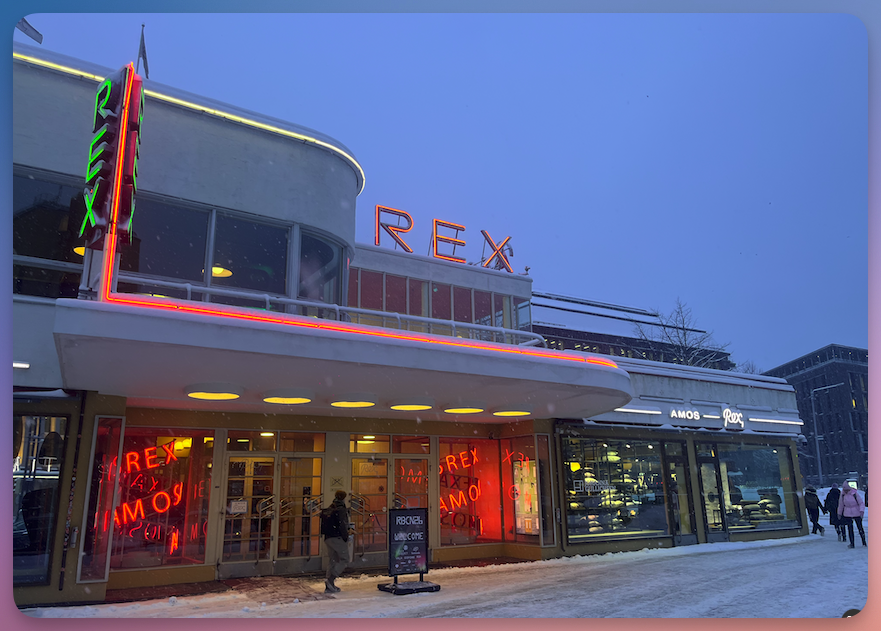
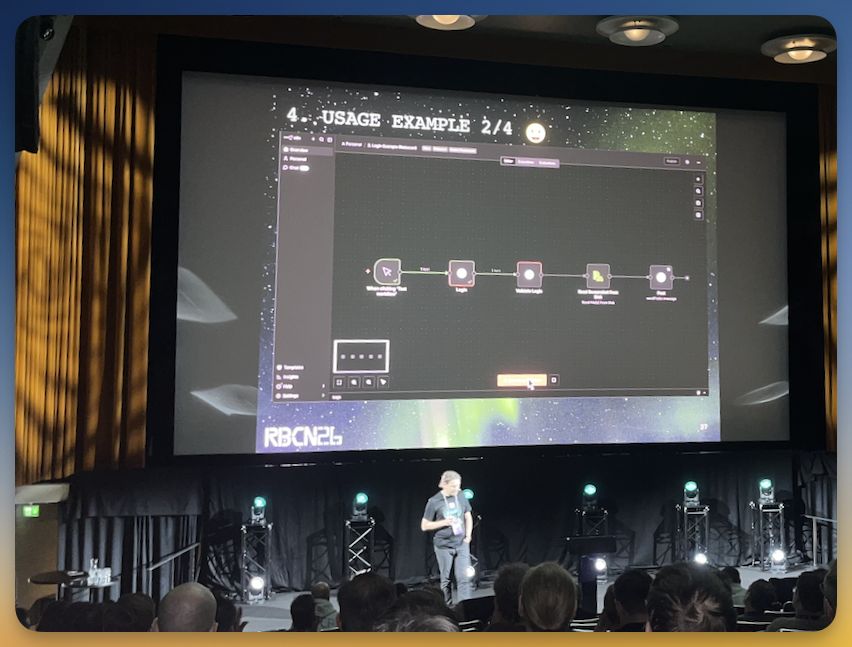
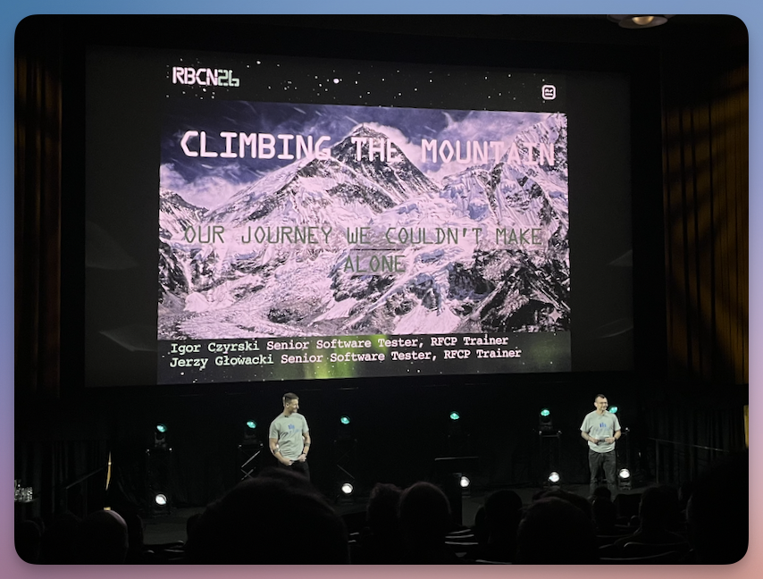
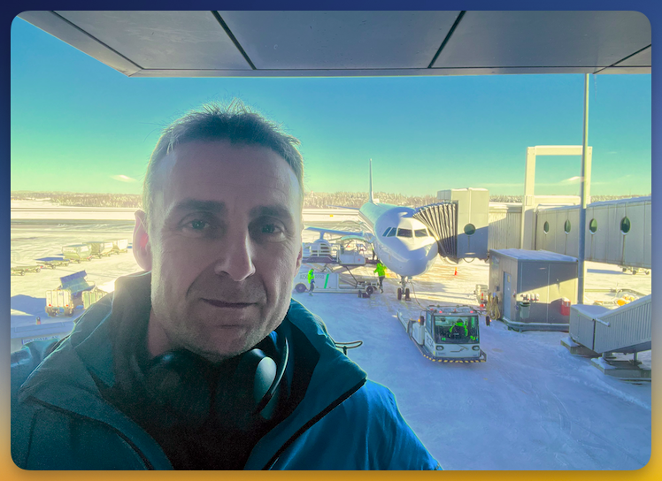
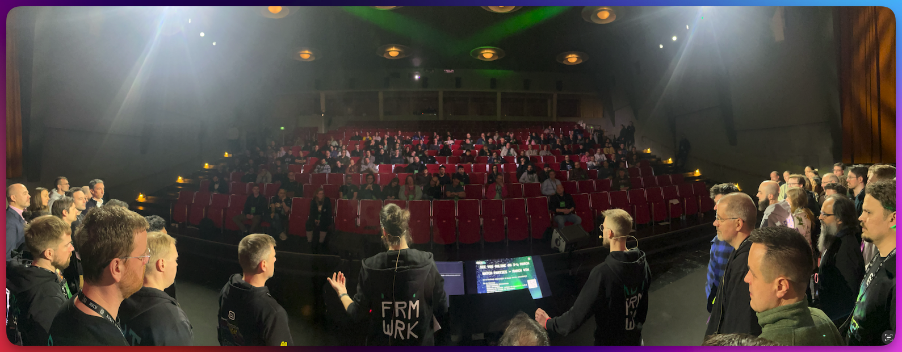

Dies ist **Teil 3** der dreiteiligen Review zur RoboCon 2026 in Helsinki.

<!--more-->

---

➛ Zurück zu **[Teil 2 (Donnerstag, Conference Day 1)]()**

---

## Freitag: Conference Day 2

### Robot Framework Core Updates



**Pekka Klärck** ist bekannt als der **Erfinder** und leitende Entwickler des Robot Frameworks.  
Er startete das Projekt 2005 im Rahmen seiner Masterarbeit an der Helsinki University of Technology (heute Aalto University) und steuert seine Entwicklung seither.  
Am zweiten Tag der Konferenz gibt Pekka traditionell einen **Überblick** über alle Entwicklungen und Aktivitäten rund um Robot Framework: welche neuen Bibliotheken entstanden sind, welche großen Updates es gab, wer sich besonders hervorgetan hat; all das kommt hier zur Sprache.

Zwei Features im Core der Versionen **7.3** und **7.4** stechen besonders hervor:

- **Variable Types**: Die Möglichkeit, Variablentypen explizit anzugeben, verbessert die Code-Qualität und reduziert potenzielle Fehlerquellen. Gerade in größeren Projekten ist das ein echter Gewinn an Klarheit.
- **Secret Variables**: Ein längst überfälliges Feature, das den Umgang mit sensiblen Daten wie Passwörtern oder API-Keys deutlich sicherer macht. Keine Klartext-Credentials mehr in Logs bedeuten einen wichtigen Schritt in Richtung produktionsreifer Automation. (Siehe dazu auch meinen [Artikel](secretvars/) zu diesem Thema)

Ein weiteres Thema: Ein neues **Manual** ist in Arbeit, wird aber noch einige Zeit dauern. Pekka rief die Community auf, sich daran zu beteiligen.  
Wer gerne mitmachen möchte, kann sich im Slack-Channel [#manual-editing](https://robotframework.slack.com/archives/C063Y9GEMUP) melden.  

Dann kam ein Thema, das vielen aus der Seele gesprochen haben dürfte: **Namespace-Handling**. Aktuell existiert nur **Suite Scope** für Library- und Resource-Imports. Das ist, man muss es ganz offen sagen, **problematisch**.

Wenn beispielsweise ein Keyword in einer Resource-Datei definiert ist und nur dort verwendet werden soll, ist es trotzdem von überall her erreichbar.  
Robot Framework fehlt schlicht die Möglichkeit, Keywords als **privat** zu markieren.  
Das führt zu unübersichtlichem Code und ungewollten Abhängigkeiten. In großen Projekten ist das ein echtes Ärgernis.

Pekka nimmt sich dieser Problematik für **Version 8** an. Die geplanten Änderungen sollen eine stärkere Kontrolle über die Sichtbarkeit bzw. den Scope von Keywords und Variablen ermöglichen.  
(Das ist aus meiner Erfahrung einer der Punkte in der RF-Syntax, bei denen programmier-erfahrene Kursteilnehmer ungläubig die Augenbrauen hochziehen...)

Wie jedes Jahr gab Pekka auch einen Überblick über die **neuesten Beiträge aus der Community**. 

Ich möchte an dieser Stelle gerne einen eigenen Hinweis geben: Die Seite [awesome-robotframework](https://github.com/MarketSquare/awesome-robotframework) bietet eine tolle Übersicht über **alle Robot-Framework-Projekte**: Libraries, Listener oder Drittanbieter-Projekte, alles ist vertreten.  

Wer etwas Bestimmtes sucht oder einfach nur stöbern möchte, sollte unbedingt mal vorbeischauen.

---

### Bringing Robot Framework into n8n Visual Workflows



Automation entfaltet den größten Wert, wenn sie mit anderen Tools und Services interagiert.
Genau hier setzt Namiks Projekt an: **n8n-nodes-robotframework** ermöglicht es, Robot-Framework-Tasks direkt in visuelle Workflows von n8n zu integrieren. Damit öffnet sich der Zugang zum gesamten Ökosystem an Integrationen. 

Das heißt: Robot-Framework-Tests können nahtlos mit Nodes für APIs, Datenbanken, Messaging-Systeme und AI-Services verbunden werden. Anders als in Robot Framework werden die Nodes visuell miteinander verbunden, ohne zusätzlichen Code schreiben zu müssen.

Man könnte natürlich argumentieren: *"All das geht auch direkt mit Robot Framework."*  
Stimmt, aber die Nodes in n8n kapseln die Funktionalität der APIs bereits auf einem **höheren Abstraktionsniveau**.  
Das spart Zeit und reduziert die Komplexität erheblich.

Namik zeigte in seinem Vortrag einige anschauliche Beispiele.  
Zugegeben, es waren keine professioneller Natur, sondern rein privater – bisher ist das ein **ausschließlich privates Projekt** (doppelter Respekt dafür! 👏).  

Aber die **Use Cases** waren trotzdem sehr spannend:

Namik  automatisierte das **Aufladen seiner Handy-Prepaid-Karte** 📱 mit 8n.  
**Problem**: der Anbieter stellt keine API dafür bereit.  
**Lösung**: über n8n-cron startet er ein Robot-Framework-Script, das sich mit Playwright ([BrowserLibrary](https://marketsquare.github.io/robotframework-browser/Browser.html)) headless beim Anbieter einloggt und das Guthaben auflädt.

Im zweiten Beispiel wollte Namik wissen, ob auf Autoscout interessante Autos zum Verkauf stehen, die er potenziell mit Gewinn weiterverkaufen könnte.  
Das **Problem**: Benachrichtigungen von Autoscout kommen oft viel zu spät (manchmal erst einen Tag später), da ist das Auto dann längst weg.  
**Lösung**: Er automatisierte das über n8n. Das System schaut regelmäßig nach neuen Autos (mit **randomisiertem Intervall**, natürlich, um Bot-Detection zu vermeiden).  
Taucht ein interessantes Angebot auf, bekommt er eine E-Mail mit Screenshot.  
Dank n8n kann er zudem eine **KI-Bewertung** von OpenAI einfügen, die ihre Einschätzung zum Wiederverkaufswert gibt.

> *Übrigens, hier gleich noch ein toller Tipp von ihm für alle, die darum kämpfen, dass sie als Bot erkannt werden von der Gegenseite: es lohnt sich auszuprobieren, im Keyword [New Context](https://marketsquare.github.io/robotframework-browser/Browser.html#New%20Context) die **"geolocation"**-Permission auf `true` zu setzen.  
Bots haben nämlich normalerweise keine Geolocation aktiviert.  
Auch das manuelle Setzen des **User Agents** ist eine effektive Strategie, um an Bot-Sperren vorbeizukommen.  
(Habe ich natürlich alles in mein [Trainingsmaterial](https://lp.robotmk.org/robotmk-masterclass-4d-de) aufgenommen ☺️)*

Besonders clever: Namik nutzte das Keyword [Save Storage State](https://marketsquare.github.io/robotframework-browser/Browser.html#Save%20Storage%20State), um den aktuellen Browser-Zustand (z. B. alle gesetzten Cookies) zu speichern und an den nächsten Node weiterzugeben.  
So kann der folgende Node direkt im **eingeloggten State** weitermachen. Eine sehr elegante Art, Teilschritte an separate Nodes zu delegieren.

👉 **Fazit**  
Namiks Vortrag war für mich persönlich ein Highlight. Ich nutze [n8n](https://n8n.io) seit Langem und kenne mich gut damit aus. N8N ist ein fantastisches Tool für Workflow-Automation.  
Der Vortrag war inspirierend, technisch fundiert und zeigte eindrucksvoll, wie sich **visuelle Workflow-Automation** und **Robot Framework** gegenseitig ergänzen können.  
Ich hab im Flieger auf dem Heimweg über die Zukunft von RPA nachgedacht und muss sagen: wer Business Prozesse automatisieren möchte, sollte sich statt Robot Framework mal n8n anschauen. 

---

### Climbing the Mountain: Our Journey We Couldn't Make Alone





Die Session von Igor Czyrski und Jerzy Głowacki vom QA-Team von NiceProject erzählte eine Geschichte, mit der sich manche in der Robot-Framework-Community identifizieren können:  
den Weg von der **ersten Tool-Adoption** hin zum **aktiven Community-Building**.  

Die beiden nutzten die Metapher des **Bergsteigens**, um ihre vierjährige Reise zu illustrieren. Diese Analogie zog sich durch die gesamte Präsentation.

NiceProject begann 2020 mit der Nutzung von Robot Framework. Die Entscheidung fiel aufgrund der Vielseitigkeit. Aber die zunehmende Komplexität der Projekte, insbesondere in der Desktop-Automatisierung, offenbarte schnell die **Grenzen der isolierten Arbeit**.  

Die eigenen Custom Libraries stießen an ihre Kapazitätsgrenzen.  
Die „steilen Hänge" der technischen Hindernisse erforderten schließlich die Suche nach breiterer Expertise.

Igor und Jerzy beschrieben dann die Phase der **kritischen Transition**: von lokalen Anwendern zu aktiven Teilnehmern im globalen Ökosystem.  

Ihr Weg führte sie durch mehrere Schlüsselphasen = „Camps": Die **Entdeckungsphase**, in der das Team erkannte, dass die bisherigen Methoden nicht mehr ausreichten.  

Dann kam die **Community-Integration**: internationale Treffen wie die RoboCon wurden zur „Berghütte" für das Team. Ein Ort der Sicherheit, des Wissensaustauschs und der Regeneration.

Der entscheidende Wendepunkt war für sie der **Shift von Climbers zu Guides**: NiceProject trat der Robot Framework Foundation bei und etablierte [WRobocon](https://wrobocon.eu) – eine zweite große Robot-Framework-Konferenz.  

Diese „*kleine Schwester der RoboCon*" zieht mittlerweile Sprecher aus aller Welt an und erfreut sich großer Beliebtheit.  
Dieser strategische Schritt hin zum aktiven Beitrag ist ein Paradebeispiel dafür, wie Konsumenten von Open Source zu echten **Enablers** und Multiplikatoren werden können.

Natürlich ist nicht jeder ein geborener Community-Gründer, und es braucht auch nicht 100 RoboCons auf dieser Welt. 😉  
Die zentrale Botschaft der Session war eine andere: **technisches Wachstum ist selten ein Solo-Projekt**.  
Die beiden betonten, wie kollaborative Umgebungen die Resilienz ganzer Teams stärken.  
Ihre Reise war veranschaulicht über die verschiedenen "Höhenlagen" des Bergsteigens und machte deutlich, dass wirklicher Fortschritt dann geschieht, wenn Organisationen ihre isolierte Implementierung hinter sich lassen und zu einem aktiven Teil der Community werden.

👉 **Fazit**: Ein wirklich inspirierender Einblick in eine Reise, die zeigt, **wie aus Nutzern Macher werden**. Und wie wertvoll es ist, nicht nur die Community zu nutzen, sondern ihr aktiv etwas zurückzugeben, indem man sie mitgestaltet.  

Ich muss sagen, **Hut ab vor NiceProject** dafür, wie die Jungs die letzten Jahre Gas gegeben haben. Alle RFCP-zertifiziert, aktive Contributors, WRobocon-Organisation, ... das sind wirklich gewichtige Beiträge zu Robot Framework.

Ach, und übrigens:

- Hier im Blog findet ihr auch eine Review zur [Wrobocon 2025](http://localhost:1314/de/blog/wrobocon25-recap/).
- Die [WRobocon 2026](https://wrobocon.eu) findet am 8. Oktober statt. Wer gerne ein Thema beitragen will, reicht es einfach ein – der [Call for Papers](https://tally.so/r/3lPJlk) ist offen.

---

### How AI tools affect learning and the implications on open source tools



**Arttu Taipale** ist Automation Developer bei Knowit Solutions und nutzt Robot Framework täglich sowohl in RPA- als auch in Testautomatisierungsprojekten. Er ist ein leidenschaftlicher Open-Source-Enthusiast mit ausgeprägtem Problemlösungsinstinkt. Seit vier Jahren bietet er Robot-Framework-Schulungen an.  
Diese Erfahrung gab ihm direkten Einblick, wie sich **Lernen im Zeitalter von GenAI verändert**.

Seine Session stellte eine grundlegende Frage:  
**Wie lernen wir Softwareentwicklung, wenn GenAI-Tools zunehmend den Code für uns schreiben?**

Die **Herausforderung** ist real: ChatGPT besteht problemlos Physikprüfungen an britischen Universitäten (wie eine Studie der University of Hull zeigt), und Unternehmen berichten, dass mehr Code von GenAI generiert wird als manuell geschrieben.

Der Kern seines Arguments basierte auf **Lerntheorie**,  illustriert mit "Star-Wars"-Metaphern, die überraschend gut funktionierten: **Receiving** (neue Informationen aufnehmen) versus **Retrieval** (Wissen abrufen und anwenden).  
Luke Skywalker, der zum ersten Mal ein Lichtschwert in die Hand nimmt, stand für den Anfänger.  
Erst durch die Übung gegen den Droiden im Millennium Falcon, also aktives **Retrieval**, verankert sich Wissen.

Das Problem mit AI-Tools: sie machen Receiving leichter, **untergraben aber Retrieval**.  
Wenn wir Code-Generierung auslagern, hören wir auf, Verbindungen im Gehirn zu festigen.  

Noch schlimmer: wir machen **die falschen Fehler**.  
Arttu zeigte (bewusst überspitzte) Beispiele aus seinen Trainings, in denen Teilnehmer versuchten, Probleme mit AI zu lösen. Das Ergebnis: veraltete Syntax, überkomplizierte Lösungen oder Keywords aus den falschen Bibliotheken.  
Für Anfänger, die noch keine mentalen Modelle haben, bieten diese Fehler keine Basis zum Lernen.

Die zentrale Warnung: Es entsteht eine **Divergenz zwischen Lernen und Tun**.  
Junior Developer könnten GenAI nutzen, um die einfachen Aufgaben zu beherrschen, die eigentlich die Basis ihrer Ausbildung sein sollten, um dann in eine Wissenslücke zu fallen, wenn sie vor komplexen Problemen stehen, wo AI nicht hilft.  
"*Stellt euch vor, Luke Skywalker hätte C3PO gesagt, er soll bis zum letzten Film alle seine Kämpfe ausführen*". Er hätte gegen Darth Vader keine Chance gehabt... 

Seine Empfehlung war klar, aber unbequem: **wir müssen dasselbe lernen wie vorher**, mit derselben Tiefe.  
AI-Tools sind Produktivitätsmultiplikatoren für diejenigen, die bereits verstehen, was sie bauen.  

Der beste Weg, um AI-Nutzung zu beherrschen? Seine Empfehlung: **lest Bücher**. Denn Prompting erfordert zu verstehen, wonach man fragt und kritisches Denken beim Analysieren der Antworten.

Zuletzt richtete Arttu den Blick auf **Robot Framework selbst**: Wird es ein Tool bleiben, das mit GenAI effizient nutzbar ist? Oder gewinnen andere Tools die Oberhand?  
Die Open-Source-Natur von Robot Framework ist ein Vorteil, aber die schiefen Trainings-Daten der LLMs (oft mit veralteter Syntax) stellen eine reale Herausforderung dar.

👉 **Fazit**  
Eine der **zum Nachdenken anregendsten Sessions** der Konferenz.  
Arttu navigierte gekonnt zwischen Pragmatismus und kritischer Reflexion.  
Seine Botschaft: AI ist **kein Ersatz für tiefgehendes Wissen**. Es ist ein Tool für diejenigen, die bereits wissen, wie man den Hammer führt.  
Die Community muss aktiv daran arbeiten, dass Robot Framework im AI-Zeitalter relevant bleibt.  
Nicht etwa durch Widerstand gegen AI, sondern durch bessere Integration und aktualisierte Lernressourcen.

---

### PlatynUI: Cross-platform desktop UI automation for Robot Framework



**Daniel Biehl** stellte [PlatynUI](https://github.com/imbus/platynui-sut) vor, eine Library, die **Desktop-UI-Automation** plattformübergreifend unter Windows, Linux und macOS einheitlich macht.  

PlatynUI greift ein Problem auf, das jeder kennt, der schon einmal Desktop-Tests geschrieben hat: es ist nicht einfach, vor allem für Anfänger robust Tests damit zu schreiben.  
**Timing**-Probleme, **Fokus**-Probleme, **asynchrone UIs** – Desktop-Automation ist von Grund auf eine etwas zickige Angelegenheit.  

Und so kommt es, dass man aus purer Verzweiflung mit `Sleep`s arbeitet, Buttons in `FOR`-Schleifen hintereinander weggeklickt werden etc. Das sind alles Workarounds für ein tieferliegendes Problem.

Daniel erklärte das am Keyword `Click`:

- Was **erwarten** wir? Dass die Anwendung so reagiert, als hätte ein User geklickt.  
- Was **tut** das Keyword? Es feuert lediglich ein einzelnes Mouse-Event auf eine Koordinate ab, ohne zu prüfen, ob das Element sichtbar, aktiviert oder fokussiert ist. Ein Click ist also nur ein *Vorschlag*, keine Garantie.

PlatynUI bietet statt Keywords für Mechanismen wie "Click" stattdessen **semantische Aktionen**: Keywords wie `Activate`, `Focus`, `Check` oder `Select` beschreiben die *Intention* – das gewünschte Ergebnis.  
Jede dieser Aktionen folgt einem klaren Muster:  

- **Preconditions**: Fenster aktiv, Element im Viewport, Element enabled? 
- **Perform**: Aktion ausführen. 
- **Postcondition**: Warten, bis die Anwendung bereit ist.  

Das kommt einigen vielleicht bekannt vor: Playwright, das in der [BrowserLibrary](https://marketsquare.github.io/robotframework-browser/Browser.html) zum Einsatz kommt, nutzt einen ähnlichen Ansatz mit seinen [Actionability Checks](https://playwright.dev/docs/actionability). Auch hier kann ein Button nur dann geklickt werden, wenn die Actionability-Checks festgestellt haben, dass das Element sichtbar/active und nicht durch ein anderes Element überdeckt ist.

**PlatynUI ist noch in Entwicklung**. Tooling, Keywords und Platform-Coverage sind noch nicht final.  
Das Projekt zeigt aber bereits jetzt einen soliden, prinzipiengeleiteten Ansatz für ein chronisches Problem in der Desktop-Automation.  
Und wie ich in meiner Review zum **PlatynUI-Workshop** oben geschrieben habe: wenn Unternehmen wie die **Deutsche Flugsicherung** PlatynUI nun schon produktiv nutzen, deutet das darauf hin, dass es hinreichend reif ist. 

👉 **Fazit**  
PlatynUI ist nicht das Allheilmittel: gerade im Bereich Synthetic Monitoring wird es immer Anwendungsfälle geben, in denen Image-Comparison-Bibliotheken die einzige Lösung sind (z. B. RDP/Citrix).  
Aber in allen anderen Fällen wird PLatynUI mit seinem „*Robot Framework First*"-Ansatz ein echter Game Changer sein.  
(Wer Interesse an einer Schulung hat, möge sich bei mir melden; ich arbeite gerade an dem Material.)

---

### After RoboCon is before RoboCon

Die Woche war wieder einmal wie im Flug vergangen.  
Vier Tage voller Vorträge, Diskussionen und neuer Ideen – und plötzlich wieder auf dem Weg zum Flieger nach Hause, den Kopf voller Ideen und eine Sammlung an Notizen (die ich in diesem Blog-Artikel nun endlich verarbeitet habe 🤗 ).

Was RoboCon für mich besonders macht, ist, wie viele Themen ineinandergreifen: von AI über Testarchitektur bis hin zu Infrastruktur. Und wie sie abbilden, wohin sich das Ökosystem rund um Robot Framework bewegt.

Einige der Ansätze werde ich in den kommenden Monaten sicher weiterverfolgen. Andere werden sich vielleicht erst mit etwas Distanz erschließen.  
Genau das ist der Wert solcher Events: Sie setzen **Impulse, die nachwirken**.

Vielleicht überzeugt diese Review den ein oder anderen, 2027 dabei zu sein.

Schreibt gerne in die Kommentare unterhalb, wie es euch gefallen hat. 

**After RoboCon is before RoboCon!**

---

➛ Zurück zu [Teil 1 (Dienstag/Mittwoch, Workshop & Community Day)]()  
➛ Zurück zu [Teil 2 (Donnerstag, Conference Day 1)]()

