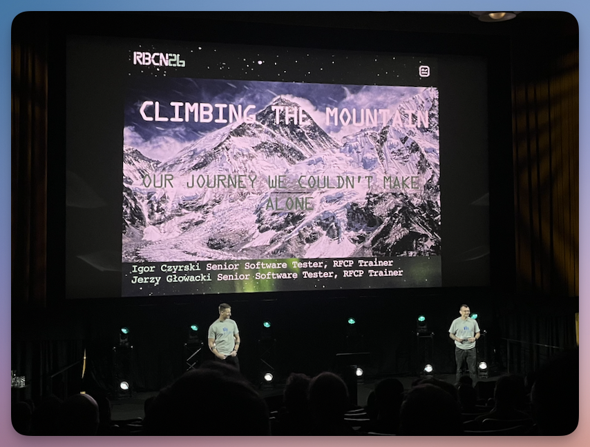
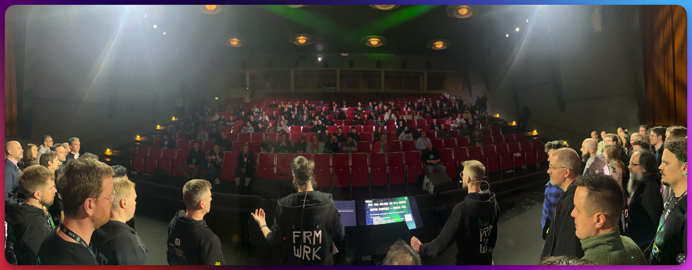

This is **Part 3** of the three-part review of RoboCon 2026 in Helsinki.

<!--more-->

---

➛ Back to **[Part 2 (Thursday: Conference Day 1)]()**

---

## Friday: Conference Day 2

### Robot Framework Core Updates



**Pekka Klärck** is known as the **inventor** and lead developer of Robot Framework.  
He started the project in 2005 as part of his master's thesis at Helsinki University of Technology (now Aalto University) and has been steering its development ever since.  
On the second day of the conference, Pekka traditionally provides an **overview** of all developments and activities related to Robot Framework: which new libraries have been created, which major updates have been made, who has particularly distinguished themselves – all of this is covered here.

Two features in the core of versions **7.3** and **7.4** stand out in particular:

- **Variable Types**: The ability to explicitly declare variable types improves code quality and reduces potential sources of error. This is a real gain in clarity, especially in larger projects.
- **Secret Variables**: A long-overdue feature that makes handling sensitive data such as passwords or API keys considerably more secure. No more plain text credentials in logs – an important step towards production-ready automation. (See also my [article](secretvars/) on this topic)

Another topic: A new **manual** is in the works, but it will take some time. Pekka called on the community to contribute.  
Anyone who would like to participate can sign up in the Slack channel [#manual-editing](https://robotframework.slack.com/archives/C063Y9GEMUP).  

Then came a topic that surely spoke to many: **namespace handling**. Currently, only **suite scope** exists for library and resource imports – and that is, frankly, problematic.

For example, if a keyword is defined in a resource file and is only supposed to be used there, it is still accessible from anywhere.  
Robot Framework simply lacks the ability to mark keywords as **private**.  
This leads to confusing code and unwanted dependencies – a real nuisance, especially in large projects.

Pekka intends to address this issue in **version 8**. The planned changes will allow for greater control over the visibility of keywords and variables – a long-awaited step towards cleaner, more modular code.

As he does every year, Pekka also provided an overview of the **latest contributions from the community**. 

I would like to take this opportunity to offer a tip of my own: The [awesome-robotframework](https://github.com/MarketSquare/awesome-robotframework) page offers a great overview of **all Robot Framework projects** – be it libraries, listeners or third-party projects.  

If you are looking for something specific or just want to browse, you should definitely check it out.

---

### Bringing Robot Framework into n8n Visual Workflows



Automation delivers the greatest value when it interacts with other tools and services.
This is exactly where Namik's project comes in: **n8n-nodes-robotframework** makes it possible to integrate Robot Framework tasks directly into n8n's visual workflows – giving you access to the entire ecosystem of integrations. 

This means that Robot Framework tests can be seamlessly connected to nodes for APIs, databases, messaging systems and AI services – all configured visually, without having to write additional code.

Of course, one could argue: *"All of this can also be solved directly with Robot Framework."*  
Sure – but the nodes in n8n already encapsulate the functionality of APIs at a **higher level of abstraction**.  
This saves time and significantly reduces complexity.

Namik showed some illustrative examples in his presentation.  
Admittedly, these were not of a professional nature, but purely private – so far, this is a **purely private project** (double respect for that! 👏)  – but the use cases were still very exciting:

Namik automated the **recharging of his mobile phone prepaid card** 📱 with 8n.  
**Problem**: the provider does not provide an API for this.  
**Solution**: Using n8n-cron, he starts a Robot Framework script that logs in headlessly to the provider using Playwright ([BrowserLibrary](https://marketsquare.github.io/robotframework-browser/Browser.html)) and tops up the credit.

In the second example, Namik wanted to know whether there were any interesting cars for sale on Autoscout that he could potentially resell at a profit.  
The **problem**: Autoscout notifications often arrive far too late (sometimes a day later), by which time the car is long gone.  
**Solution**: He automated this using n8n. The system regularly checks for new cars (with a **randomised interval**, of course, to avoid bot detection).  
If an interesting offer appears, he receives an email with a screenshot.  
Thanks to n8n, he can also add an **AI evaluation** by OpenAI, which gives its assessment of the resale value.

> *By the way, here's a great tip from him for anyone struggling with being recognised as a bot by the other party: it's worth trying to set the **"geolocation"** permission in the [New Context](https://marketsquare.github.io/robotframework-browser/Browser.html#New%20Context) keyword to `true`.  
Bots usually do not have geolocation enabled.  
Manually setting the **user agent** is also an effective strategy for getting past bot blocks.  
(Of course, I've added everything to my [training material](https://lp.robotmk.org/robotmk-masterclass-4d-de) ☺️)*

Particularly clever: Namik used the keyword [Save Storage State](https://marketsquare.github.io/robotframework-browser/Browser.html#Save%20Storage%20State) to save the current browser session (e.g. all set cookies) and passed it on to the next node.  
This allows the following node to continue directly in the **logged-in state** – an elegant way of delegating sub-steps to separate nodes.

👉 **Conclusion**  
Namik's presentation was a highlight for me personally. I have been using [n8n](https://n8n.io) for a long time and am very familiar with it – it is a fantastic tool for workflow automation.  
The presentation was inspiring, technically sound and impressively demonstrated how **visual workflow automation** and **Robot Framework** can complement each other.  
I thought about the future of RPA on the plane home and have to say: anyone who wants to automate business processes should take a look at n8n instead of Robot Framework. 

---

### Climbing the Mountain: Our Journey We Couldn't Make Alone





The session by Igor Czyrski and Jerzy Głowacki from the NiceProject QA team told a story that some in the Robot Framework community can relate to:  
the journey from **initial tool adoption** to **active community building**.  

The two used the metaphor of **mountain climbing** to illustrate their four-year journey – an analogy that ran throughout the presentation.

NiceProject started using Robot Framework in 2020. The decision was made based on its versatility, but the increasing complexity of projects – especially in desktop automation – quickly revealed the **limitations of working in isolation**.  

Their own custom libraries reached their capacity limits.  
The "steep slopes" of technical roadblocks ultimately required a search for broader expertise.

Igor and Jerzy then described the phase of **critical transition**: from local users to active participants in the global ecosystem.  

Their journey took them through several key phases = "camps": The **discovery phase**, in which the team realised that the previous methods were no longer sufficient.  

Then came **community integration** – international meetings such as RoboCon became a "mountain hut" for the team. A place of safety, knowledge exchange and regeneration.

The decisive turning point for them was the **shift from climbers to guides**: NiceProject joined the Robot Framework Foundation and established [WRobocon](https://wrobocon.eu) – a second major Robot Framework conference.  

This "*little sister of RoboCon*" now attracts speakers from all over the world and enjoys great popularity.  
This strategic step towards active contribution exemplifies how consumers of open source can become true **enablers** and multipliers.

Of course, not everyone is a born community founder, and we don't need 100 RoboCons in this world. 😉  
The central message of the session was different: **technical growth is rarely a solo project**.  
The two emphasised how collaborative environments strengthen the resilience of entire teams.  
Their journey – documented across the various "altitude levels" of mountain climbing 🏔️ – made it clear that real progress happens when organisations leave their isolated implementation behind and become an active part of the community.

👉 **Conclusion**: A truly inspiring insight into a journey that shows **how users become creators** – and how valuable it is not only to use the community, but to give something back to it by actively shaping it.  

I have to say, **hats off to NiceProject** for how the guys have stepped on the gas in recent years. All RFCP-certified, active contributors, WRobocon organisation, ... these are truly significant contributions to Robot Framework.

Oh, and by the way:

- Here in the blog, you'll also find a review of [Wrobocon 2025](http://localhost:1314/de/blog/wrobocon25-recap/).
- [WRobocon 2026](https://wrobocon.eu) will take place on 8 October. If you'd like to contribute a topic, just submit it – the [Call for Papers](https://tally.so/r/3lPJlk) is open.

---

### How AI tools affect learning and the implications on open source tools



**Arttu Taipale** is an automation developer at Knowit Solutions and uses Robot Framework daily in both RPA and test automation projects. He is a passionate open source enthusiast with a strong problem-solving instinct. He has been offering Robot Framework training for four years – an experience that has given him direct insight into how **learning is changing in the GenAI era**.

His session posed a fundamental question:  
**How do we learn software development when GenAI tools are increasingly writing the code for us?**

The **challenge** is real: ChatGPT easily passes physics exams at British universities (as a study at the University of Hull showed), and companies report that more code is generated by GenAI than written manually.

The core of his argument was based on **learning theory** – illustrated by Star Wars metaphors that worked surprisingly well: **receiving** (taking in new information) versus **retrieval** (recalling and applying knowledge).  
Luke Skywalker, picking up a lightsaber for the first time, represented the novice.  
Only through practice against the droid in the Millennium Falcon – through active **retrieval** – is knowledge anchored.

The problem with AI tools: they make receiving much easier, **but undermine retrieval**.  
When we outsource code generation, we stop consolidating connections in the brain.  

Worse still, we make **the wrong mistakes**.  
Arttu showed (deliberately exaggerated) examples from his training sessions where participants tried to solve problems with AI. The result: outdated syntax, overly complicated solutions or keywords from the wrong libraries.  
For beginners – who don't yet have mental models – these mistakes offer no basis for learning.

The key warning: a **divergence between learning and doing** arises.  
Junior developers could use GenAI to master the simple tasks that should actually be the basis of their training – only to then fall into a knowledge gap when faced with complex problems where AI does not help. "*Imagine Luke Skywalker telling C3PO to fight all his fights until the final movie*" – he would have had no chance against Darth Vader. 

His recommendation was clear, but uncomfortable: **we must learn the same things as before** – with the same depth.  
AI tools are productivity multipliers for those who already understand what they are building.  

The best way to master AI use? His recommendation: **read books**. Because prompting requires understanding what you are asking – and critical thinking when analysing the answers.

Finally, Arttu turned his attention to **Robot Framework itself**: Will it remain a tool that can be used efficiently with GenAI? Or will other tools gain the upper hand?  
The open-source nature of Robot Framework is an advantage, but the skewed training data of LLMs (often with outdated syntax) poses a real challenge.

👉 **Conclusion**  
One of the **most thought-provoking sessions of the conference**.  
Arttu skilfully navigated between pragmatism and critical reflection.  
His message: AI is **no substitute for in-depth knowledge** – it is a tool for those who already know how to wield the hammer.  
The community must actively work to ensure that Robot Framework remains relevant in the AI era – not by resisting AI, but through better integration and updated learning resources.

---

### PlatynUI: Cross-platform desktop UI automation for Robot Framework



**Daniel Biehl** presented [PlatynUI](https://github.com/imbus/platynui-sut), a library that makes **desktop UI automation** consistent across platforms on Windows, Linux and macOS.  

PlatynUI addresses a problem familiar to anyone who has ever written desktop tests: it is not easy, especially for beginners, to write robust tests with it.  
**Timing** issues, **focus** problems, **asynchronous UIs** – desktop automation is inherently a bit of a pain.  

And so it happens that, out of sheer desperation, people work with `Sleep`s, buttons are clicked in rapid succession in `FOR` loops, etc. These are all workarounds for a deeper problem.

Daniel explained this using the keyword `Click`:

- What do we **expect**? That the application responds as if a user had clicked.  
- What does the keyword **do**? It simply fires a single mouse event at a coordinate – without checking whether the element is visible, activated or focused. A click is therefore only a *suggestion*, not a guarantee.

Instead of keywords for mechanisms such as "Click", PlatynUI offers **semantic actions**: Keywords such as `Activate`, `Focus`, `Check` or `Select` describe the *intent* – the desired result.  
Each of these actions follows a clear pattern:  

- **Preconditions**: Window active, element in viewport, element enabled? 
- **Perform**: Execute the action. 
- **Postcondition**: Wait until the application is ready.  

This may sound familiar to some: Playwright, which works in the [BrowserLibrary](https://marketsquare.github.io/robotframework-browser/Browser.html), uses a similar approach with its [actionability checks](https://playwright.dev/docs/actionability). Here, too, a button can only be clicked if the actionability checks have determined that the element is visible/active and not covered by another element.

**PlatynUI is still under development** – tooling, keywords and platform coverage are not yet finalised.  
However, the project already demonstrates a solid, principle-driven approach to a chronic problem in desktop automation.  
And as I wrote in my review of the **PlatynUI workshop** above: if companies such as **German Air Traffic Control** are already using PlatynUI productively, this indicates that it is sufficiently mature. 

👉 **Conclusion**  
PlatynUI is not the solution to all problems: especially in synthetic monitoring, there will always be use cases where image comparison libraries are the only solution (e.g. RDP/Citrix).  
But in all other cases, PlatynUI will be a real game changer with its "*Robot Framework First*" approach.  
(If you are interested in training, please contact me; I am currently working on the material.)

---

### After RoboCon is before RoboCon

The week had flown by once again.  
Four days full of presentations, discussions and new ideas – and suddenly I was back on the plane home, my head full of ideas and a collection of notes (which I have finally processed in this blog article 🤗 ).

What makes RoboCon special for me is how many topics intertwine – from AI to test architecture to infrastructure – and paint an increasingly clear picture of where the ecosystem is heading.

I will certainly be pursuing some of the approaches in the coming months. Others may only become apparent with a little distance.  
That is precisely the value of such events: they provide **impulses that linger**.

Perhaps this review will convince one or two of you to attend in 2027.

Feel free to write in the comments below how you liked it. 

**After RoboCon is before RoboCon!**

---

➛ Back to [Part 1 (Tuesday/Wednesday, Workshop & Community Day)]()  
➛ Back to [Part 2 (Thursday: Conference Day 1)]()

