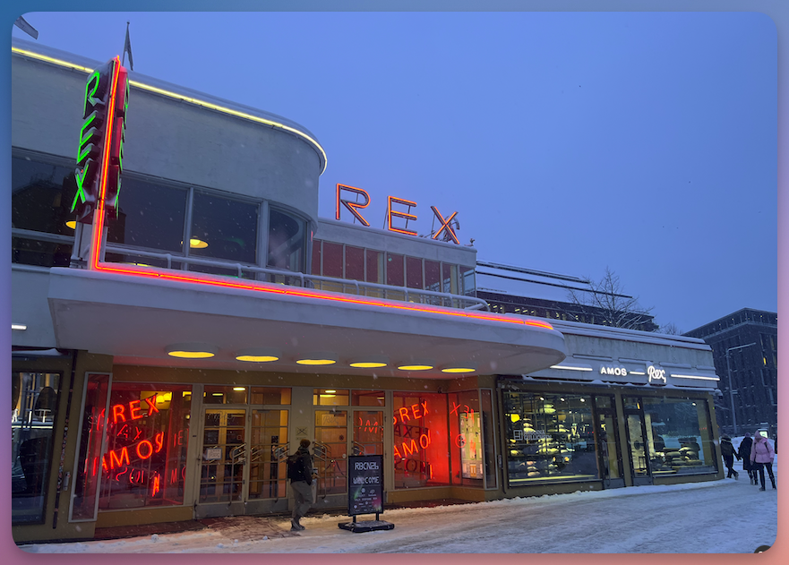

This is **Part 5** of the six-part review of RoboCon 2026 in Helsinki.

<!--more-->

---

➛ Back to **[Part 4 (Thursday: Conference Day 1)]()**  
➛ Continue to **[Part 6 (Friday: Conference Day 2)]()**

---

## Friday: Conference Day 2

### Robot Framework Core Updates



**Pekka Klärck** is known as the **inventor** and lead developer of Robot Framework.  
He started the project in 2005 as part of his master's thesis at Helsinki University of Technology (now Aalto University) and has been steering its development ever since.  
On the second day of the conference, Pekka traditionally provides an **overview** of all developments and activities related to Robot Framework: which new libraries have been created, which major updates have been made, who has particularly distinguished themselves – all of this is covered here.

Two features in the core of versions **7.3** and **7.4** stand out in particular:

- **Variable Types**: The ability to explicitly declare variable types improves code quality and reduces potential sources of error. This is a real gain in clarity, especially in larger projects.
- **Secret Variables**: A long-overdue feature that makes handling sensitive data such as passwords or API keys considerably more secure. No more plain text credentials in logs – an important step towards production-ready automation. (See also my [article](secretvars/) on this topic)

Another topic: A new **manual** is in the works, but it will take some time. Pekka called on the community to contribute.  
Anyone who would like to participate can sign up in the Slack channel [#manual-editing](https://robotframework.slack.com/archives/C063Y9GEMUP).  

Then came a topic that surely spoke to many: **namespace handling**. Currently, only **suite scope** exists for library and resource imports – and that is, frankly, problematic.

For example, if a keyword is defined in a resource file and is only supposed to be used there, it is still accessible from anywhere.  
Robot Framework simply lacks the ability to mark keywords as **private**.  
This leads to confusing code and unwanted dependencies – a real nuisance, especially in large projects.

Pekka intends to address this issue in **version 8**. The planned changes will allow for greater control over the visibility of keywords and variables – a long-awaited step towards cleaner, more modular code.

As he does every year, Pekka also provided an overview of the **latest contributions from the community**. 

I would like to take this opportunity to offer a tip of my own: The [awesome-robotframework](https://github.com/MarketSquare/awesome-robotframework) page offers a great overview of **all Robot Framework projects** – be it libraries, listeners or third-party projects.  

If you are looking for something specific or just want to browse, you should definitely check it out.

---

### Bringing Robot Framework into n8n Visual Workflows



Automation delivers the greatest value when it interacts with other tools and services.
This is exactly where Namik's project comes in: **n8n-nodes-robotframework** makes it possible to integrate Robot Framework tasks directly into n8n's visual workflows – giving you access to the entire ecosystem of integrations. 

This means that Robot Framework tests can be seamlessly connected to nodes for APIs, databases, messaging systems and AI services – all configured visually, without having to write additional code.

Of course, one could argue: *"All of this can also be solved directly with Robot Framework."*  
Sure – but the nodes in n8n already encapsulate the functionality of APIs at a **higher level of abstraction**.  
This saves time and significantly reduces complexity.

Namik showed some illustrative examples in his presentation.  
Admittedly, these were not of a professional nature, but purely private – so far, this is a **purely private project** (double respect for that! 👏)  – but the use cases were still very exciting:

Namik automated the **recharging of his mobile phone prepaid card** 📱 with 8n.  
**Problem**: the provider does not provide an API for this.  
**Solution**: Using n8n-cron, he starts a Robot Framework script that logs in headlessly to the provider using Playwright ([BrowserLibrary](https://marketsquare.github.io/robotframework-browser/Browser.html)) and tops up the credit.

In the second example, Namik wanted to know whether there were any interesting cars for sale on Autoscout that he could potentially resell at a profit.  
The **problem**: Autoscout notifications often arrive far too late (sometimes a day later), by which time the car is long gone.  
**Solution**: He automated this using n8n. The system regularly checks for new cars (with a **randomised interval**, of course, to avoid bot detection).  
If an interesting offer appears, he receives an email with a screenshot.  
Thanks to n8n, he can also add an **AI evaluation** by OpenAI, which gives its assessment of the resale value.

> *By the way, here's a great tip from him for anyone struggling with being recognised as a bot by the other party: it's worth trying to set the **"geolocation"** permission in the [New Context](https://marketsquare.github.io/robotframework-browser/Browser.html#New%20Context) keyword to `true`.  
Bots usually do not have geolocation enabled.  
Manually setting the **user agent** is also an effective strategy for getting past bot blocks.  
(Of course, I've added everything to my [training material](https://lp.robotmk.org/robotmk-masterclass-4d-de) ☺️)*

Particularly clever: Namik used the keyword [Save Storage State](https://marketsquare.github.io/robotframework-browser/Browser.html#Save%20Storage%20State) to save the current browser session (e.g. all set cookies) and passed it on to the next node.  
This allows the following node to continue directly in the **logged-in state** – an elegant way of delegating sub-steps to separate nodes.

👉 **Conclusion**  
Namik's presentation was a highlight for me personally. I have been using [n8n](https://n8n.io) for a long time and am very familiar with it – it is a fantastic tool for workflow automation.  
The presentation was inspiring, technically sound and impressively demonstrated how **visual workflow automation** and **Robot Framework** can complement each other.  
I thought about the future of RPA on the plane home and have to say: anyone who wants to automate business processes should take a look at n8n instead of Robot Framework. 

---

### Climbing the Mountain: Our Journey We Couldn't Make Alone





The session by Igor Czyrski and Jerzy Głowacki from the NiceProject QA team told a story that some in the Robot Framework community can relate to:  
the journey from **initial tool adoption** to **active community building**.  

The two used the metaphor of **mountain climbing** to illustrate their four-year journey – an analogy that ran throughout the presentation.

NiceProject started using Robot Framework in 2020. The decision was made based on its versatility, but the increasing complexity of projects – especially in desktop automation – quickly revealed the **limitations of working in isolation**.  

Their own custom libraries reached their capacity limits.  
The "steep slopes" of technical roadblocks ultimately required a search for broader expertise.

Igor and Jerzy then described the phase of **critical transition**: from local users to active participants in the global ecosystem.  

Their journey took them through several key phases = "camps": The **discovery phase**, in which the team realised that the previous methods were no longer sufficient.  

Then came **community integration** – international meetings such as RoboCon became a "mountain hut" for the team. A place of safety, knowledge exchange and regeneration.

The decisive turning point for them was the **shift from climbers to guides**: NiceProject joined the Robot Framework Foundation and established [WRobocon](https://wrobocon.eu) – a second major Robot Framework conference.  

This "*little sister of RoboCon*" now attracts speakers from all over the world and enjoys great popularity.  
This strategic step towards active contribution exemplifies how consumers of open source can become true **enablers** and multipliers.

Of course, not everyone is a born community founder, and we don't need 100 RoboCons in this world. 😉  
The central message of the session was different: **technical growth is rarely a solo project**.  
The two emphasised how collaborative environments strengthen the resilience of entire teams.  
Their journey – documented across the various "altitude levels" of mountain climbing 🏔️ – made it clear that real progress happens when organisations leave their isolated implementation behind and become an active part of the community.

👉 **Conclusion**: A truly inspiring insight into a journey that shows **how users become creators** – and how valuable it is not only to use the community, but to give something back to it by actively shaping it.  

I have to say, **hats off to NiceProject** for how the guys have stepped on the gas in recent years. All RFCP-certified, active contributors, WRobocon organisation, ... these are truly significant contributions to Robot Framework.

Oh, and by the way:

- Here in the blog, you'll also find a review of [Wrobocon 2025](http://localhost:1314/de/blog/wrobocon25-recap/).
- [WRobocon 2026](https://wrobocon.eu) will take place on 8 October. If you'd like to contribute a topic, just submit it – the [Call for Papers](https://tally.so/r/3lPJlk) is open.

---

➛ Back to [Part 4 (Thursday: Conference Day 1)]()  
➛ Continue to [Part 6 (Friday: Conference Day 2)]()
