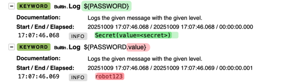
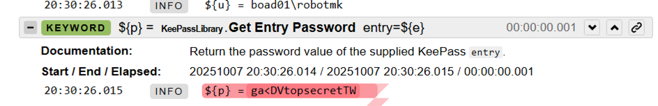
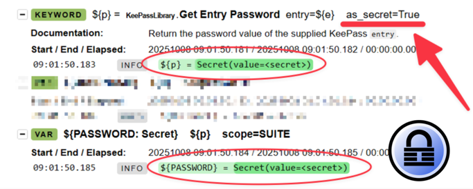

Wer mit sensiblen Daten im Robot Framework arbeitet, kennt das **Dilemma**:
Plötzlich rutscht ein Passwort, Token oder API-Key ins Log und ist für alle sichtbar... 😬

Der Grund: Robot Framework loggt einfach alles: jede Variable, jeden Keyword-Aufruf, jeden Return-Wert.  
Das ist zwar cool fürs Debugging. Aber fatal, wenn man mit echten Zugangsdaten arbeitet.

Ein **neues Feature** in Robot Framework verspricht Abhilfe - und dieser Artikel erklärt, wie genau. 

<!--more-->


## Workarounds überall – aber keine echte Lösung

Hier eine kleine "Hitparade" der Workarounds, um das Logging von sensiblen Daten zu unterbinden: 

- einen Listener nutzen (z.b. [RobotLogListener](https://rpaframework.org/libraries/robotloglistener/index.html) von Robocorp):  
das Keyword `Register Protected Keywords` wird mit einer Reihe von Keywords gefüttert, die vom Listener dann während der Ausführung abgefangen werden.  
Funktioniert zwar, aber man sollte vorher akribisch durch seinen Test gehen und die relevanten Keywords identifizieren.
- Keywords patchen oder überschreiben. Kann man machen, ist aber ziemlicher Pfusch.
- `sed`-Filter nach der Testausführung über die Logdateien laufen lassen, um sensible Daten zu entfernen. Auch schon gesehen, aber ebenfalls Pfusch.
- Log-Level ändern, sodass die Meldung verschwindet. Nicht brauchbar, weil die Daten immer noch im XML-Log liegen können. 

**Fazit:** All diese Ansätze behandeln **Symptome**, nicht die Ursache.

---

## Robot Framework 7.4: Secret Variables

Mit RF 7.4 hält ein Feature Einzug, das Du Dir unbedingt aneignen solltest: 

👉 **Secret Variables**.

Die offizielle [Release Note](https://github.com/robotframework/robotframework/blob/master/doc/releasenotes/rf-7.4b1.rst) beschreibt es so:

> *"The most important enhancement in Robot Framework 7.4 is the support for ‘secret’ variables that hide their values in data and log files. These variables encapsulate their values so that the real values are not logged even on the trace level when variables are passed between keywords as arguments and return values."*

Was bedeutet das?

Sobald eine Variable als **Secret** deklariert ist, wird ihr Wert von Robot Framework *verborgen*. 
Sie ist dann nicht mehr im Log sichtbar, auch nicht auf der detailliertesten Ebene (TRACE).

Und das Beste: das ist ein No-Brainer, bei dem man sich nicht auf externe Tools oder Scripte verlassen muss. 

---

## Wie es funktioniert

Ein paar Dinge solltest Du beachten, wenn Du Secrets verwendest.  
(Ich bediene mich der Beispiele aus den [Release Notes](https://github.com/robotframework/robotframework/blob/master/doc/releasenotes/rf-7.4b1.rst)):

### Wie entsteht ein Secret? 

Secrets können an drei Stellen erzeugt werden:

#### Als **Kommandozeilenargument**: 

    robot --variable "PASSWORD: Secret:topsecret"

Zum Vergleich hier eine "normale" Variable: 

    robot --variable "PASSWORD: topsecret"

💡 Merke: Dem Geheimnis wird einfach `Secret:` vorangestellt. 

#### In einer Variablen-Definition 

Die Definition von Secrets in der Variablen-Sektion funktioniert syntaktisch fast genauso wie mit dem `VAR` Statement, wie die beiden Beispiele zeigen: 

```
*** Variables ***
${NORMAL: Secret}     foo  ❌       #1
${NORMAL: Secret}     ${XXX}        #2
${ENVIRON: Secret}    %{EXAMPLE}    #3
${DEFAULT: Secret}    %{=robot123}  #4
${JOIN: Secret}       ${XXX}-123    #5
```

```
*** Test Cases ***
Test Example
  VAR  ${NORMAL: Secret}     foo  ❌       #1
  VAR  ${NORMAL: Secret}     ${XXX}        #2
  VAR  ${ENVIRON: Secret}    %{EXAMPLE}    #3
  VAR  ${DEFAULT: Secret}    %{=robot123}  #4
  VAR  ${JOIN: Secret}       ${XXX}-123    #5
```

Es ist wichtig zu wissen, welche Zuweisungen erlaubt sind - und warum die erste Zuweisung von "*foo*" (ein String literal) fehlschlägt.  

Treten wir dazu einen Schritt zurück: **Ziel** der Secret Vars soll ja sein, sensible Daten vor Einblicken in die **Logs** und den **Testcode** zu schützen.  

👉 Wenn "*foo*" also wirklich ein Geheimnis ist, dann hättest Du es bereits dadurch verraten, dass Du es hier im Klartext verwendest. 😉 

**Deshalb**: 

1. ❌ Sind Zuweisungen von **Literalen** (Klartext-Werten) **nicht erlaubt**.  
2. Der Wert eines Secrets (z.B. `${XXX}`) muss vom Typ **Secret** sein
3. Eine **Umgebungsvariable** kann direkt zugewiesen werden, weil diese *außerhalb des Testcodes* gesetzt wird. (selbstredend muss der Zugriff auf den Testhost geschützt sein...!)
4. Ein **Fallback-Wert** bei nicht gesetzter Umgebungsvariable ist ebenfalls eine korrekte Secret-Zuweisung.
5. Ebenso ist die **Kombination** aus einer Secret-Variable mit einem Literal möglich. 

**Eselsbrücke**: als Secret-Werte sind die erlaubt, die **von außen steuerbar** sind, statt hard codiert zu sein. 

#### Programmatische Secret-Erzeugung mit Python

[Python-basierte Variablen-Files](https://robotframework.org/robotframework/latest/RobotFrameworkUserGuide.html#getting-variables-directly-from-a-module) sind ein mächtiges Werkzeug - hier lassen sich noch vor dem Suite-Start Variablen programmatisch definieren - und ggf. auch noch dynamisch.

In einem Python-Varfile musst Du lediglich die `Secret`-Typklasse importieren - und schon kannst Du Variablen vom Typ "Secret" definieren: 


```python
from robot.api.types import Secret

USERNAME = "robot"
PASSWORD = Secret("robot123")
```

⚠️ Natürlich sollte ein solche Varfile nicht in ein Repository committed werden - füg es deshalb der Datei `.gitignore` hinzu. 

Der zweite Python-basierte Weg sind Python-Funktionen, die als Keywords Secrets zurückliefern: 

```python
from robot.api.types import Secret

def get_token(token_plain):
    return Secret(token_plain)
```

Hier steckt das eigentliche Potential für Libraries, deren Keywords sensible Daten zurückliefern.

---

### Wie greife ich auf Secrets zu? 

Der Klartext-Wert eines Secrets steckt im Attribut `.value`.  

Beispiel: das erste Log-Statement gibt das Geheimnis nicht preis.  
Im zweiten siehst Du, die Du mit der "Dot-Notation" auf das "**value**"-Attribut zugreifst: 



Aber Achtung, das `.value`-Attribut sollte eigentlich nur zu Test- oder Debug-Zwecken verwendet werden – wer es im Robot-Code verwendet, **läuft Gefahr, das Geheimnis ins Logfile zu leaken!**

Im Idealfall reichen die Keywords nur Secrets hin und her - auf den `.value` wird nur im Python-Code darunter zugegriffen. 

---

## Ein Praxisbeispiel: KeePass trifft Robot Framework

Abschließend möchte ich noch zeigen, wie ich das neue Feature direkt in einem Kundenprojekt ausprobiert und genutzt habe. 

Ein Robot-Test für ein webbasiertes Ticketsystem bezieht hier seine Zugangsdaten aus **KeePass**.  
Ungünstig: Die [KeePassLibrary](https://github.com/loomanw/robotframework-keepasslibrary) liefert das Passwort bisher im Klartext zurück – und damit landet es zwangsläufig auch im Log:



Ich habe die Library deshalb so erweitert, dass sie den Rückgabewert des Keywords [Get Entry Password](https://loomanw.github.io/robotframework-keepasslibrary/KeePassLibrary.html#Get%20Entry%20Password) optional als **Secret-Objekt** zurückgibt (natürlich nur, wenn Robot Framework in Version 7.4 oder höher ist).



Ich hoffe, der [Pullrequest](https://github.com/loomanw/robotframework-keepasslibrary/pull/42) wird bald integriert, sodass jeder von dem neuen Feature profitieren kann. 


---

## Fazit: Ein kleiner Schritt mit großer Wirkung

Eines sollten wir festhalten: Secret-Variablen sind kein "Security-Feature" im klassischen Sinn.  
Es geht hier nicht um Verschlüsselung, sondern um Verschleierung.  

Aber sie schließen eine entscheidende Lücke zwischen **Komfort** und **Datenschutz**.  
Du kannst damit nun Tests schreiben, die sensible Daten quasi nativ verwenden - ohne riskante Spuren im Log.


**Frage an dich:**
Wie gehst du aktuell mit vertraulichen Daten in deinen Robot-Framework-Tests um? Schreib es unten in die Kommentare!

