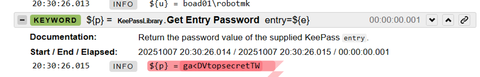

If you work with sensitive data in Robot Framework, you know the **dilemma**:
Suddenly, a password, token, or API key slips into the log and is visible to everyone... 😬
The reason: Robot Framework logs everything: every variable, every keyword call, every return value.
  
This is cool for debugging. But it's fatal when you're working with real access data.
A **new feature** in Robot Framework promises to remedy this—and this article explains exactly how.
 


<!--more-->

## Workarounds everywhere – but no real solution 

Here is a small 'best of workarounds' to prevent the logging of sensitive data: 
- Use a listener (e.g. [RobotLogListener](https://rpaframework.org/libraries/robotloglistener/index.html) from Robocorp):  
The keyword `Register Protected Keywords` is fed with a series of keywords, which are then intercepted by the listener during execution.  
This works, but you should meticulously go through your test beforehand and identify the relevant keywords. 
- Patch or overwrite keywords. You can do this, but it's quite a mess.
- Run `sed` filters on the log files after the test execution to remove sensitive data. Also seen this before, but it's also a bit of a mess.
- Change the log level so that the message disappears. Not useful because the data may still be in the XML log. 

**Conclusion:** All of these approaches treat **symptoms**, not the cause.

---

## Robot Framework 7.4: Secret Variables 

RF 7.4 introduces a feature that you should definitely learn about: 

👉 **Secret Variables**. 

The official [release note](https://github.com/robotframework/robotframework/blob/master/doc/releasenotes/rf-7.4b1.rst) describes it as follows:

> *"The most important enhancement in Robot Framework 7.4 is the support for “secret” variables that hide their values in data and log files. These variables encapsulate their values so that the real values are not logged even at the trace level when variables are passed between keywords as arguments and return values."* 

What does this mean? 

Once a variable is declared as **secret**, its value is *hidden* by Robot Framework.  
It is then no longer visible in the log, even at the most detailed level (TRACE).  
And best of all, it's a no-brainer that doesn't require you to rely on external tools or scripts.
 
---

## How it works

There are a few things you should keep in mind when using secrets.  
(I am using examples from the [release notes](https://github.com/robotframework/robotframework/blob/master/doc/releasenotes/rf-7.4b1.rst)):

### How is a secret created? 

Secrets can be created in three ways:

#### As a **command line argument**: 

    robot --variable "PASSWORD: Secret:topsecret"

For comparison, here is a "normal" variable: 

    robot --variable "PASSWORD: topsecret"

💡 Note: The secret is simply preceded by `Secret:`. 

#### In a variable definition 

The definition of secrets in the variable section works syntactically almost the same as with the `VAR` statement, as the two examples show:


```
*** Variables ***
${NORMAL: Secret}     foo  ❌       #1
${NORMAL: Secret}     ${XXX}        #2
${ENVIRON: Secret}    %{EXAMPLE}    #3
${DEFAULT: Secret}    %{=robot123}  #4
${JOIN: Secret}       ${XXX}-123    #5
```

```
*** Test Cases ***
Test Example
  VAR  ${NORMAL: Secret}     foo  ❌       #1
  VAR  ${NORMAL: Secret}     ${XXX}        #2
  VAR  ${ENVIRON: Secret}    %{EXAMPLE}    #3
  VAR  ${DEFAULT: Secret}    %{=robot123}  #4
  VAR  ${JOIN: Secret}       ${XXX}-123    #5
```

It is important to know which assignments are allowed - and why the first assignment of "*foo*" (a string literal) fails.  

Let's take a step back: the **purpose** of secret variables is to protect sensitive data from being exposed in **logs** and **test code**.  

👉 So if "*foo*" is really a secret, then you would have already revealed it by using it here in plain text. 😉 

**Therefore**:

1. ❌ Assignments of **literals** (plain text values) are **not permitted**.
2. The value of a secret (e.g. `${XXX}`) must be of type **Secret**.
3. An **environment variable** can be assigned directly because it is set *outside the test code*. (Of course, access to the test host must be protected...!)
4. A **fallback value** for an unset environment variable is also a correct secret assignment.
5. The **combination** of a secret variable with a literal is also possible. 

**Mnemonic**: Secret values are those that can be **controlled externally** instead of being hard-coded.

#### Programmatic secret generation with Python

[Python-based variable files](https://robotframework.org/robotframework/latest/RobotFrameworkUserGuide.html#getting-variables-directly-from-a-module) are a powerful tool – they allow you to define variables programmatically before the suite starts – and dynamically, if necessary.

In a Python varfile, you only need to import the `Secret` type class – and you can then define variables of the type "Secret":


```python
from robot.api.types import Secret

USERNAME = "robot"
PASSWORD = Secret("robot123")
```

⚠️ Of course, such a varfile should not be committed to a repository – therefore, add it to the `.gitignore` file.

The second Python-based method involves Python functions that return secrets as keywords:

```python
from robot.api.types import Secret

def get_token(token_plain):
    return Secret(token_plain)
```

This is where the real potential lies for libraries whose keywords return sensitive data.

---

### How do I access secrets? 

The plaintext value of a secret is stored in the `.value` attribute.  

Example: the first log statement does not reveal the secret.  
In the second, you can see that you access the "**value**" attribute using "dot notation": 


But be careful, the `.value` attribute should really only be used for testing or debugging purposes – if you use it in robot code, **you run the risk of leaking the secret into the log file!**

Ideally, the keywords should only pass secrets back and forth – the `.value` should only be accessed in the Python code below.


---

## A practical example: KeePass meets Robot Framework

Finally, I would like to show how I tried out and used the new feature directly in a customer project. 

A robot test for a web-based ticket system obtains its access data from **KeePass**.  
Unfortunately, the [KeePassLibrary](https://github.com/loomanw/robotframework-keepasslibrary) currently returns the password in plain text, which inevitably ends up in the log:



I have therefore extended the library so that it optionally returns the return value of the keyword [Get Entry Password](https://loomanw.github.io/robotframework-keepasslibrary/KeePassLibrary.html#Get%20Entry%20Password) as a **secret object** (only if Robot Framework is version 7.4 or higher, of course) .


I hope the [pull request](https://github.com/loomanw/robotframework-keepasslibrary/pull/42) will be integrated soon so that everyone can benefit from the new feature.

---

## Conclusion: A small step with a big impact

One thing we should note: Secret variables are not a "security feature" in the traditional sense.  
This is not about encryption, but about concealment.  

However, they close a crucial gap between **convenience** and **data protection**.  
You can now write tests that use sensitive data natively, so to speak, without leaving risky traces in the log.


**Question for you:**
How do you currently handle confidential data in your Robot Framework tests? Write your answer in the comments below!


