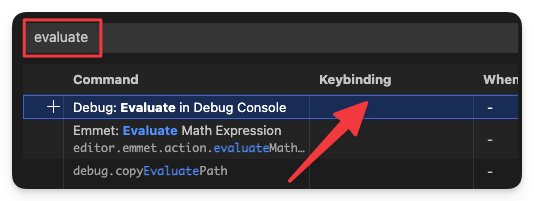
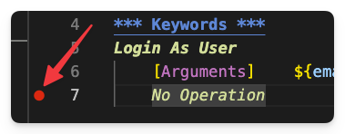

**Be honest**: how many times a day do you press the ⏵ button in VS Code? How much time have you spent waiting for the browser to finally start up?  
If your workflow is an endless loop of trial and error involving writing a keyword, starting a test, writing the next keyword, starting the test again...  then this hack is for you.

<!--more-->

---

I've been using this shortcut myself for years.  
It puts an end to that frustrating stop-and-go and lets you develop your keywords "live" during the test – without ever having to restart your browser.  
Once you know this trick, you'll wonder how you ever managed without it.

**Why "Helsinki shortcut"?**

Quite simply: At RoboCon in Helsinki ([here]()  is my detailed review), I spontaneously gave a lightning talk on how to break this vicious circle.  

The feedback was great – hardly anyone knew about this feature!  
That's why I simply call it the "Helsinki Shortcut". 😅

**The problem**: Flying blind when coding

Many people work like this: they write a keyword, run the test and hope that what they have added works as expected. If not? Abort, correct, restart.  
This is not only slow, but also extremely annoying.

**The solution**: The debugger (and a magic shortcut)

Some only use the debugger in the RobotCode extension to find concrete bugs.  
But the real potential that no one knows about: live interaction with the Debug Console.

---

## How the trick works

### 1. Setting up the shortcut

The quickest way to access the shortcut configuration in VS Code is with the combination `Ctrl+K + Ctrl+S` (on Mac, use the ⌘ key instead of Ctrl).

Search for the keyword `evaluate`. In the entry *Evaluate in Debug Console*, double-click in the "Keybinding" column.

Assign the shortcut **Alt+D** to this command.

(If Alt+D is already assigned, simply delete the old assignment first.)

### 2. Set a breakpoint

Set a breakpoint at the point where you want to develop the next keyword (no: *the* next keywords, that's the joke!): to do this, click on the narrow margin to the left of the line number so that a **round red dot** appears.

**Tip:** I like to use the dummy keyword `No Operation` for this – because it does exactly that: nothing. This is particularly useful if you want to create a new user keyword that does not yet contain any keywords. An "empty" keyword results in a syntax error – `No Operation` solves the problem.

> The breakpoint tells the debugger where to pause execution. 

### 3. Start the debugger

Now start the debugger by right-clicking on the "Start" arrow next to the test case and selecting **Debug Test**: 

Execution stops at this exact point. You can see this because the breakpoint is outlined in yellow and the line is highlighted in yellow: 

### 4. Evaluating directly in the Editor

And now we come to the highlight: professionals know that when the debugger is paused, they can execute Robot Framework keywords in the Debug Console: 

The disadvantage of this is that once a keyword works as expected, it has to be copied back into the editor. This is also copy-paste work that you can save yourself from now on.

**Starting today, you can write your code directly in the editor.**

With **Alt+D**, you can fire the keyword of the active line (or the selected lines – also very handy) directly into the debug console without having to activate it first.  

You can immediately see in the browser whether it works – without losing focus, without copy-paste, without restarting.

## The video

In the video, I show you step by step, using the example of a **web shop test**, how you can replace the widely used method of "debugging" (which isn't actually debugging at all) with efficient evaluation in the debug console using Alt+D:

(*english video is comming soon!*)

 <wistia-player media-id="kwbpu1kea3" aspect="1.7777777777777777"></wistia-player>

 
 

---

## The Robot Framework Accelerator – Become a pro 🚀

The **Helsinki Shortcut** is just the tip of the iceberg.  

A spontaneous idea in Helsinki turned into something big – I am about to launch the  

**Robot Framework Accelerator** 

An intensive training course that is unlike any other.  
It brings together tricks like these to form a complete package. 

**The launch is coming soon and places are limited.**

👉 Sign up for my [Robotmk newsletter](https://www.robotmk.org/en/newsletter/) now to stay up to date.

How do you like the shortcut? Write your comments below! 👇

PS: By the way, the web shop test can be found here in the [Robotmk Examples Repo](https://github.com/Checkmk/robotmk-examples/tree/main/examples/web/web-webshop).