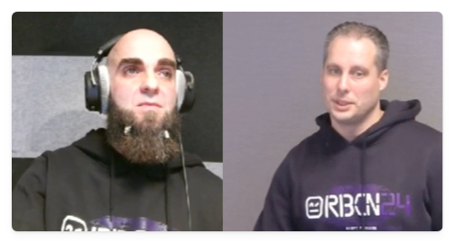
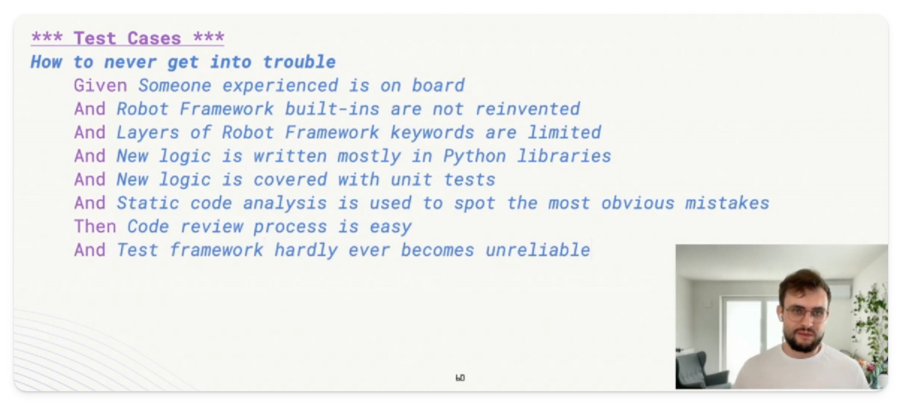
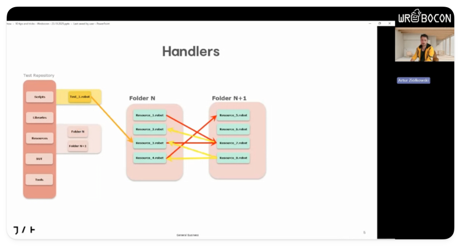
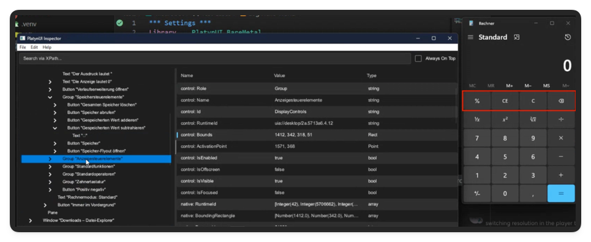

Die **WROBOCON** ist die „*kleine Schwester*“ der bekannten jährlich stattfindenden [Robocon in Helsinki](www.robocon.io), aber sie braucht sich keineswegs zu verstecken.  

Nein, im Gegenteil: Mit spannenden Vorträgen, Workshops und einer aktiven Community wurde hier von NiceProject ein Format etabliert, das kurzweilig, lehrreich und menschlich zugleich war.  
Meine persönliche Meinung dazu. 

<!--more-->

Am 23. Oktober 2025 traf sich die Robot Framework Community zur WROBOCON25 – einem kompakten, rein virtuellen Event, organisiert von [Niceproject](https://niceproject.eu) aus Polen.  

Obwohl „nur“ online, fühlte sich die Konferenz super lebendig an – dank des *WorkAdventure*-Formats, in dem sich alle Teilnehmer mit Avataren über ein bunt gestaltetes Konferenzareal bewegten.  

So entstanden sofort spontane Gespräche, sobald man sich einander näherte: die Plattform schaltet die eng beisammenstehenden Personen dann zu einem Videocall zusammen.  
(Anfangs ist das etwas ungewohnt, aber mir hat das höllisch Spaß gemacht. Ich habe wieder viele bekannte Gesichter getroffen - und auch neue kennengelernt.)

Den virtuellen Raum der Wrobocon fand ich sogar besser als bei der Online-Robocon, weil er nicht so weitläufig war.

---

## Begrüßung mit Überraschungsgast

Die Eröffnung übernahmen **Kris** von Niceproject und **Guido** als Co-Moderator.  
Aber der wahre Überraschungsmoment war, als **Miikka Solmela, Executive Director der Robot Framework Foundation**, nicht einfach nur remote zugeschaltet war, sondern live im Studio in Polen neben Kris stand.

---

## "Model-Based Testing" (MBT) mit Anne Kramer

**Anne Kramer** eröffnete die Vortragsrunde mit ihrer Präsentation über [Model-Based Testing](https://en.wikipedia.org/wiki/Model-based_testing).  

Ihr Einstieg war sehr anschaulich: Ein U-Bahn-Plan als Beispiel für Abstraktion.  
Unsere ganze Welt besteht aus Abstraktionen - warum sollte das beim Testing anders sein?  
Abstraktionen haben schließlich das Ziel, das **Wesentliche zu modellieren** und alles andere wegzulassen.

Sie zeigte die Unterschiede zwischen grafischen und textuellen Modellen, und betonte, dass MBT auch mit Robot Framework möglich ist.  
Sie erklärte, wie in dem Tool YEST Testabläufe quasi "High Level" beschrieben werden. Das Tool erzeugt daraus automatisch Tests in RF.

Zwar hätte ich mir noch konkretere RF-Beispiele (ohne YEST Tool) gewünscht, aber der Vortrag war ein starker Impuls, sich intensiver mit MBT im Kontext von Robot Framework zu beschäftigen.

---

## Listener als Datenquelle: Dirk O. Schweier

Mit viel technischer Tiefe und klarem Praxisbezug zeigte dann **Dirk O. Schweier**, wie man mit den RF Listeners die Laufzeiten von Tests automatisch erfassen und in externe Tools wie **Neoload** übertragen kann.  

> Ein Robot Framework Listener ist ein Stück Python-Code, mit der Benutzer Ereignisse während der Testausführung überwachen und darauf reagieren können, z. B. Teststart, Testende, Test bestanden oder Test nicht bestanden.  
(Listener arbeiten auf Basis des sog. "Observer Pattern" – ein [Designpattern der "Gang of 4"](https://en.wikipedia.org/wiki/Design_Patterns).)
> Listener kommen in vielen Szenarien zum Einsatz, z.b. um benutzerdefinierte Protokolle und Berichte zu erstellen oder während oder nach der Testausführung eine Integration mit anderen Tools durchzuführen. Sogar in den laufenden Test kann damit eingegriffen werden. 

Dirk zeigte, wie er in zwei Anläufen bei seinem aktuellen Ansatz landete - zunächst setzte er manuell Messpunkte per Custom Keywords, um die Laufzeiten bestimmer Abschnitte an Neoload zu übertragen. Allerdings sind das Ein griffe in den Testcode, die man eigentlich vermeiden will.   

Und so landete er bei seinem zweiten Ansatz: Statt manuell Messpunkte zu setzen, nutzt er die Listener-Methoden `end_keyword`, `end_test` und `log_message`, die quasi in Echtzeit (also: noch vor dem Testende) Ergebnisse an die API von Neoload schicken.  

Wirklich toll fand ich an Dirks Vortrag, wie er es schaffte, die technischen Hintergründe von Listeners zu erklären. Das war top. 

---

## Kacper Borucki: Teste deinen Test-Code!

Dieser Vorteag war mein persönliches Sahnestück. 

Kacpers These: **Die Qualität deiner Software kann nie besser sein als Qualität Deiner Tests.**

> "Ist es verrrückt, Tests für Testcode zu schreiben? Ganz und gar nicht."

Gerade bei Robot Framework mit seiner niedrigen Einstiegshürde besteht das Risiko, dass unerfahrene Testautoren  auf zu große Projekte losgelassen werden. Dann wird mit Gewalt alles in Robot Framework-Syntax geschrieben, in endlos verschachtelten Keyword-Hierarchien und zuletzt werden auch Funktionalitäten nachgefrickelt, die es mit etwas Kenntis der Builtin-Library nicht bräuchte.  

Kacper zeigte auf, wie man mit Pytest sehr effektiv Tests schreiben kann, die sicherstellen, dass Keywords nicht nur den "Happy Path" testen können (also, dass etwas funktioniert), sondern auch den "Unhappy Path" (z.b. verifizieren, dass Sicherheits- und Validierungsmechanismen korrekt greifen).

Seine Zusammenfassung im Gherkin-Stil war nicht nur charmant, sondern auch ein praxisnaher Leitfaden, wie man Test-Code professionell gestaltet. Ich habe mir zum Glück einen Screenshot davon gemacht und ich hoffe, er gestatt es mir, dass ich ihn hier veröffentliche - das war einfach klasse: 

---

## Artur Ziótkowski: Ten Tips and Tricks to Master Robot Framework

**Artur Ziótkowski** lieferte zehn handfeste Tipps für den effektiven Einsatz von Robot Framework – von Variablenmanagement über Resource Imports bis zum Page Object Model.  

Offen gesagt, habe ich zu bestimmten Ratschlägen eine andere Meinung (z.b. seine Abneigung gegenüber Embedded Keyword Arguments - die würde ich nicht pauschal so stehenlassen - oder seine Strategie zum Import von Ressourcen).

Jedenfalls waren seine Impulse so vielfältig, dass ich meine Sicht auf dieses Themem in einer kleinen Blogserie weiterverarbeiten und vorstellen möchte.

Ein Vortrag, der auf alle Fälle Lust gemacht hat, die eigene Toolbox zu hinterfragen, zu bewerten und ggf. zu erweitern!

---

## Workshops am Nachmittag

Am Nachmittag bot sich dann die Gelegenheit praxisnahe Entwicklungen aus der Robot-Framework-Community live zu erleben. Drei Workshops standen zur Auswahl: 

- A (semi) short history of OpenApiDriver (Robin Mackaij)
- Build Your Web Testing Framework with Browser Library (Jerzy Gtowacki)
- Cross-Platform Desktop Testing with robotframework-platynui (Daniel Biehl)

Ich nahm an der Session von Daniel Biehl teil, der den aktuellen Entwicklungsstand seiner **[PlatynUILibrary](https://github.com/imbus/robotframework-PlatynUI)** präsentierte.  

Diese Library ermöglicht die Automatisierung von Desktop-Applikationen unter Windows und Linux – mit einem klaren Fokus auf Robot Framework.

Daniel verfolgt dabei einen konsequenten Robot-Framework-First-Ansatz: Anstatt auf bestehende GUI-Testtools aufzubauen, entwickelt er die Library streng nach der RobotFramework-Philosophie.  

Besonders beeindruckend fand ich den von ihm inzwischen entwickelten Element-Inspektor, mit dem sich Desktop-Elemente gezielt analysieren lassen, um passende Selektoren zu identifizieren. Der hat auch ein CLI-Interface, mit dem sich die Fensterelemente for noch schnelleren Zugriff quasi "katalogisieren" lassen.  
Disclaimer: ein Grundverständnis von XPath ist hier sehr hilfreich. Aber Daniel zeigte, dass sich damit schnell produktiv arbeiten lässt.

Die Library wird Daniels Aussage zufolge bereits in mehreren Unternehmen produktiv genutzt.  
Die erste stabile Version soll Ende des Jahres erscheinen.

Ich freue mich ganz besonders, dass Daniel im November bei unserem Münchner Robot Framework User Group Treffen (RFUGM) zu Gast sein wird, wo er PlatynUI noch einmal live in Aktion zeigen wird – ein Pflichttermin für alle, die den nächsten Schritt in der Desktop-Automatisierung gehen wollen.

Hier übrigens geht's zur neuen Homepage mit Anmeldung zum Email-Newsletter mit den neuesten Terminen: 

**https://rfugm.robotmk.org**

---

## Fazit & Ausblick

Die WROBOCON25 hat mir wieder mal gezeigt, dass auch ein rein virtuelles Event echten Mehrwert bieten kann.  
Die Vorträge waren allesamt sehr vielfältig und interessant.

Ich habe von der WROBOCON viele Denkanstöße mitgenommen – und kann an dieser Stelle auch nur empfehlen, die vielen Möglichkeiten, sich neuen Input zu holen und sich mit der Community zu vernetzen, zu nutzen.  

Events dieser Klasse bringen uns nicht nur weiter, sie bringen uns zusammen.

