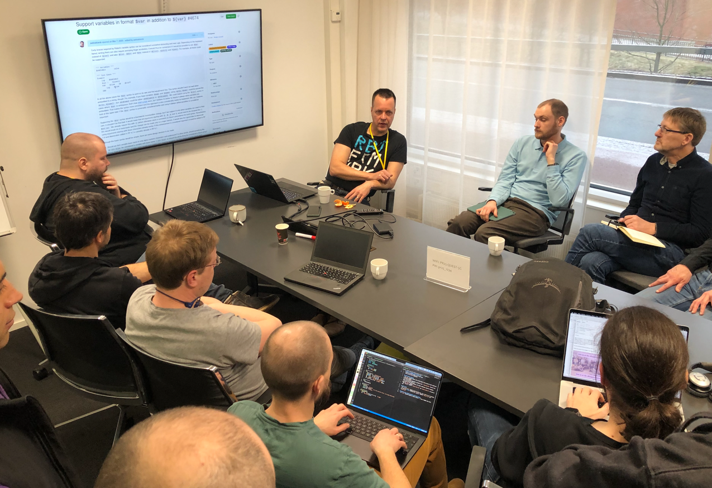
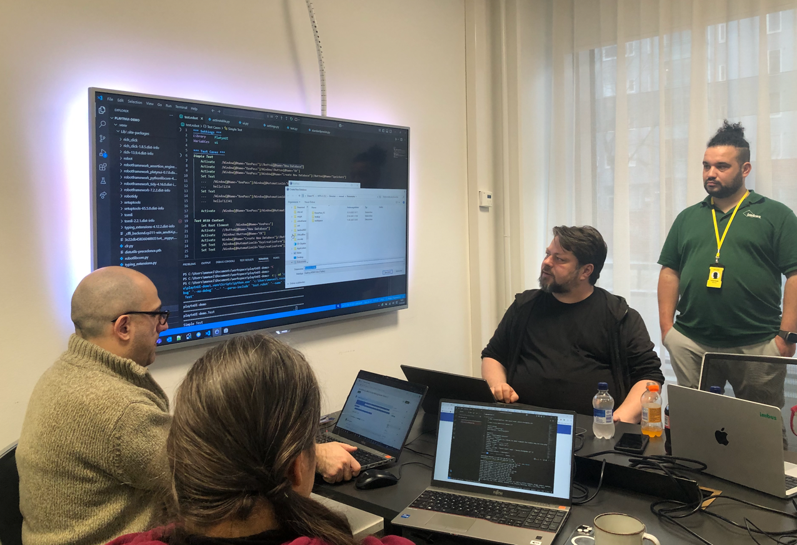
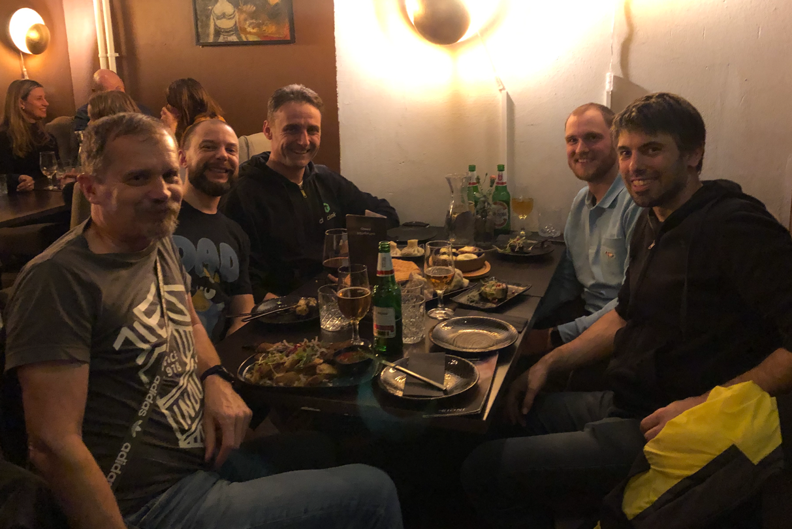

The RoboCon week traditionally starts with the **"Unconference Day ”** - a day on which the Robot Framework community freely organizes itself and discusses the topics that move it most without a fixed program.  

My summary of this day...

<!--more-->

# RoboCon 2025 - Day 1: The Unconference Day 🚀

Thanks to **Eficode**, who make their conference rooms available for the community day every year, there is a relaxed, creative atmosphere in which **anything can happen, but nothing has to**.  

The **"Law of Two Feet ”** applies: If one session doesn't suit you (anymore), you simply move on to the next one.  

No obligation, no fixed agenda - but lots of exciting discussions and brand new insights into what the future holds. 

And that's exactly what makes this day so valuable!  

---

## My highlights from the Unconference Day

### DataDriver - Dynamic test data management in Robot Framework

The first session was with **René Rohner**, the author of the [DataDriver Library](https://github.com/Snooz82/robotframework-datadriver).  
He showed how you can write your own DataReader class with just a few lines of Python code.

**Why I am so enthusiastic about this?**  

👉 With **DataDriver** test data is **completely decoupled from the test logic**.  
👉 Instead of a hard-wired list, you can **use new, random data sets** for each test run.  

An example.

In a **webshop test**, 5 items have to be placed in the shopping cart.  
Instead of storing these **fixed in the code**, DataDriver can randomly select 5 out of 10,000 products in the database each time using a custom DataReader.

This means **more flexible, more realistic tests** - a real gain for **scalable test automation**!  

---

### Robot Framework 7.3 Planning

Also interesting was the session with **Pekka Klärck**, the inventor and main developer of **Robot Framework**.  
It is always exciting to hear directly from the source **where the framework is heading** - and Pekka gave us insights into the considerations for the upcoming version **7.3**.  

The plans for a new syntax for masking variables, which protects secret data (such as passwords or API keys) from being stored unintentionally in logs, sound promising.  

Anyone who has ever worked with test automation in security-critical areas knows how important this feature will be.  

---

### AI & Robot Framework - Intelligent test automation

Another exciting topic was **AI in Automated Testing** with **Davi Fogl**. 

Ok, it was actually about everything that has anything to do with AI. What I found exciting was how he uses GPT Assistants in his work with Robot Framework documentation (e.g. the syllabus for RFCP certification).

Nothing new really - but that's what the Unconference is all about: **Getting bumped into the right ideas!**  

---

### PlatynUI - Promising approach to UI testing

An absolute highlight was the session by **Daniel Biehl** on his latest development PlatynUI, a new library for the automation of desktop applications. 

**What's so special about it?** Take a look at this list: 

✅ **Cross-Platform**: Runs on **Windows, Mac & Linux**.  
✅ **Robot Framework First**: PlatynUI uses the UI Automation API **natively on  Windows**, without third-party dependencies, completely tailored to Robot Framework.  
✅ **No more “zombie clicks ”**: Image pattern-based approaches such as **ImageHorizonLibrary** often have the problem that they “see” inactive buttons and mistakenly click on them. I know this all too well from my many years of experience with the ImageHorizonLibrary.  
✅ **State aware**: The library knows whether the UI has actually changed after an action - or whether it is still in a loading state and therefore not yet ready for the next click. 

(This reminds me a lot of the leap that the BrowserLibrary made for web testing:  
Where in Selenium you used to have to include **explicit wait times** and assertions after each click, the **BrowserLibrary** automatically synchronizes with the actual browser state.)  

➡️ **PlatynUI** could do exactly that for desktop testing - and that would be a real **quantum leap**!  

---

## My conclusion to the Unconference Day

- Finnish muesli bars are delicious
- Inspiring talks
- Discovered brand new developments in the **Robot Framework ecosystem**.  
- And of course a great end to the day at the Georgian **"Rioni ”**! 😋  

RoboCon 2025 has officially begun - and this first day has already set the bar pretty damn high. I can't wait to see what the next few days bring!

